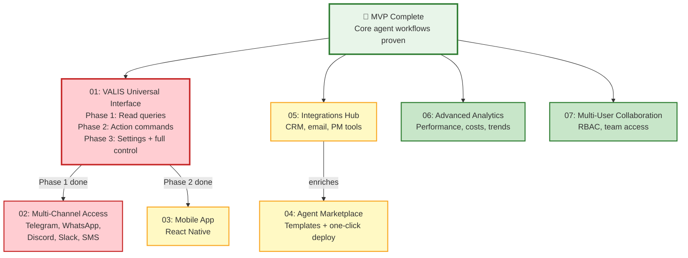

# Future Features

Central hub for planned features beyond MVP. Each feature has its own document with full context, rationale, architecture notes, and open questions.

---

## Feature Map

| # | Feature | Priority | Phase | Status |
|---|---------|----------|-------|--------|
| 01 | [[future/01-valis-universal-interface\|VALIS Universal Interface]] | Critical | Post-MVP | Designing |
| 02 | [[future/02-multi-channel-access\|Multi-Channel Access]] | High | After VALIS Phase 1 | Concept |
| 03 | [[future/03-mobile-app\|Mobile App]] | Medium | After VALIS | Concept |
| 04 | [[future/04-agent-marketplace\|Agent Marketplace]] | Medium | Phase 3 | Concept |
| 05 | [[future/05-integrations-hub\|Integrations Hub]] | Medium | Post-MVP | Concept |
| 06 | [[future/06-advanced-analytics\|Advanced Analytics]] | Low | Phase 4 | Concept |
| 07 | [[future/07-multi-user-collaboration\|Multi-User Collaboration]] | Low | Phase 4 | Concept |

---

## Priority & Dependency Flow

---

## The Big Idea

The core thesis behind these features: **ARM should be controllable entirely through natural language.** The UI is the visual layer for dashboards, graphs, and complex layouts. But every action, query, and setting change should also be possible by just *talking to VALIS*.

Think of it like this:
- **ARM UI** = the cockpit with all the instruments and switches
- **VALIS** = the copilot who can flip any switch for you when you ask

You can always use the cockpit directly. But you can also just tell VALIS what you need.

---

## Related Documentation

- [[visual/13-valis-meta-agent|VALIS Architecture Diagrams]] — Current VALIS technical design
- [[PRD]] — Product requirements and user personas
- [[ARCHITECTURE]] — System architecture
- [[MASTER-TASK-LIST]] — Current development phases
