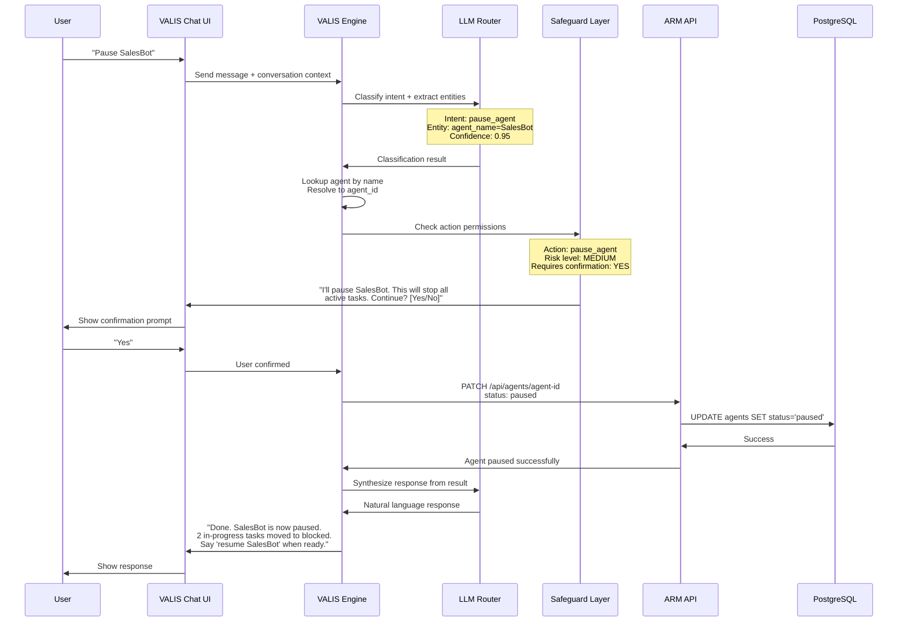
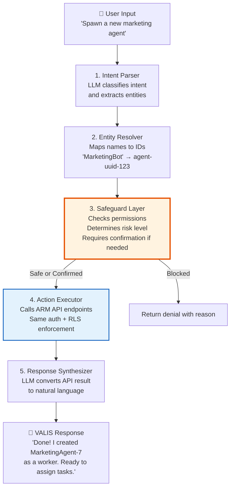
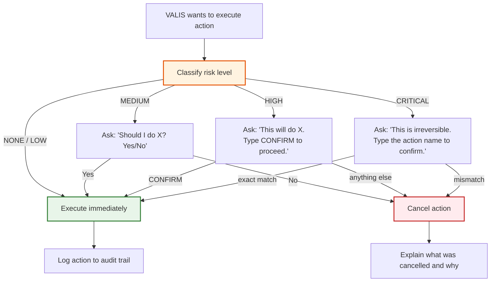
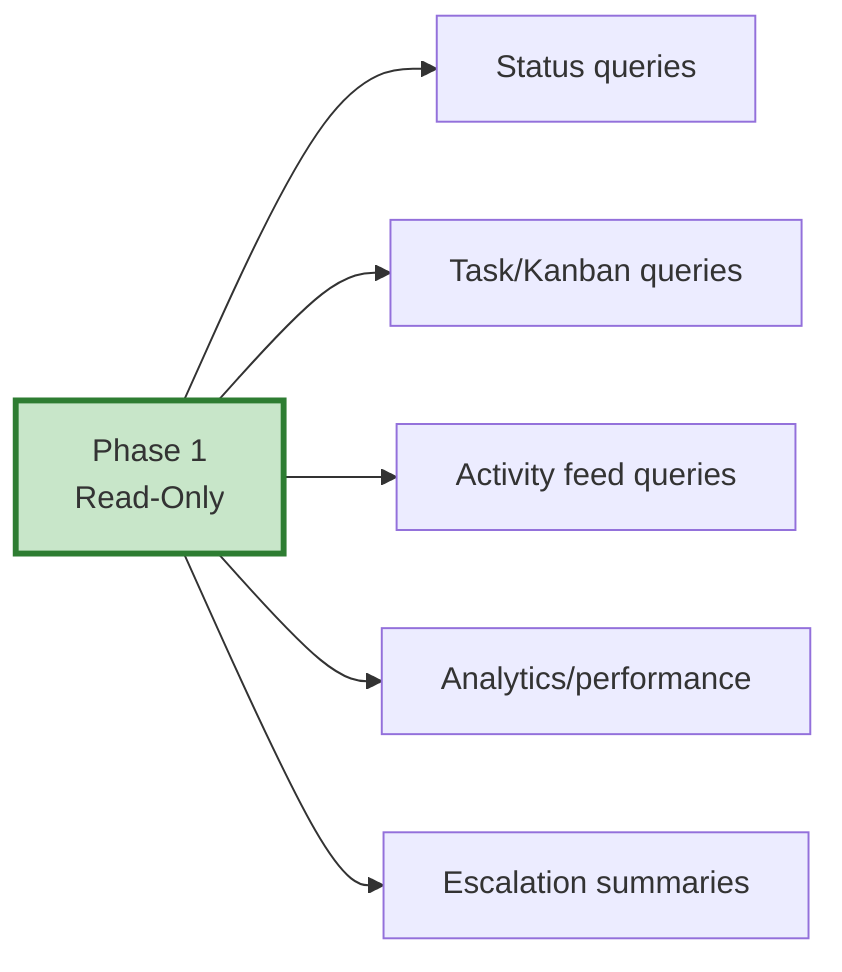
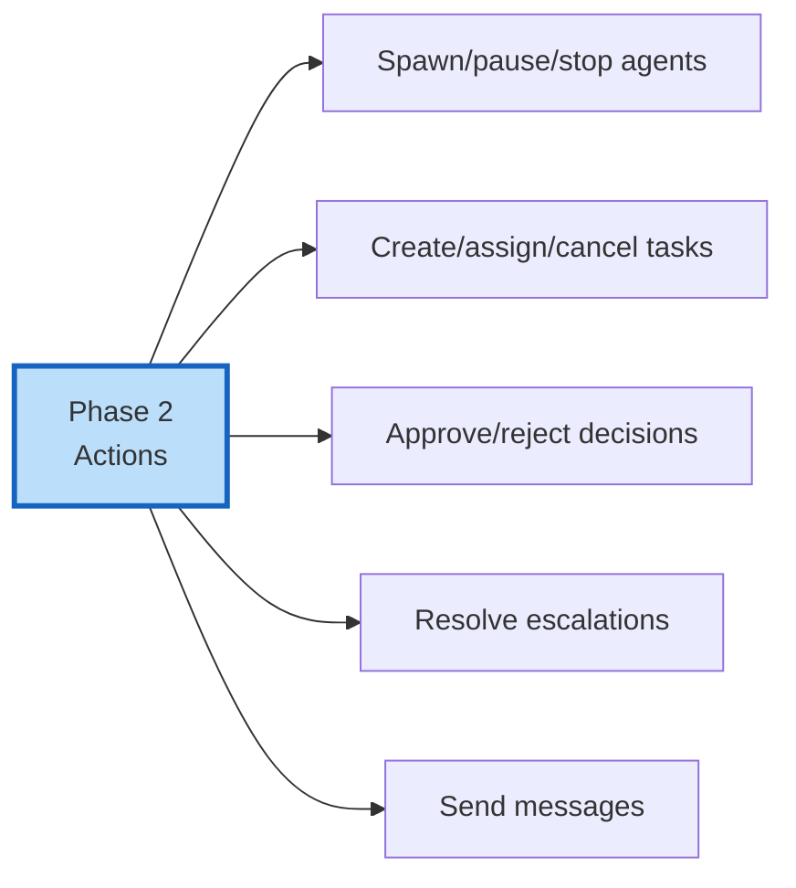
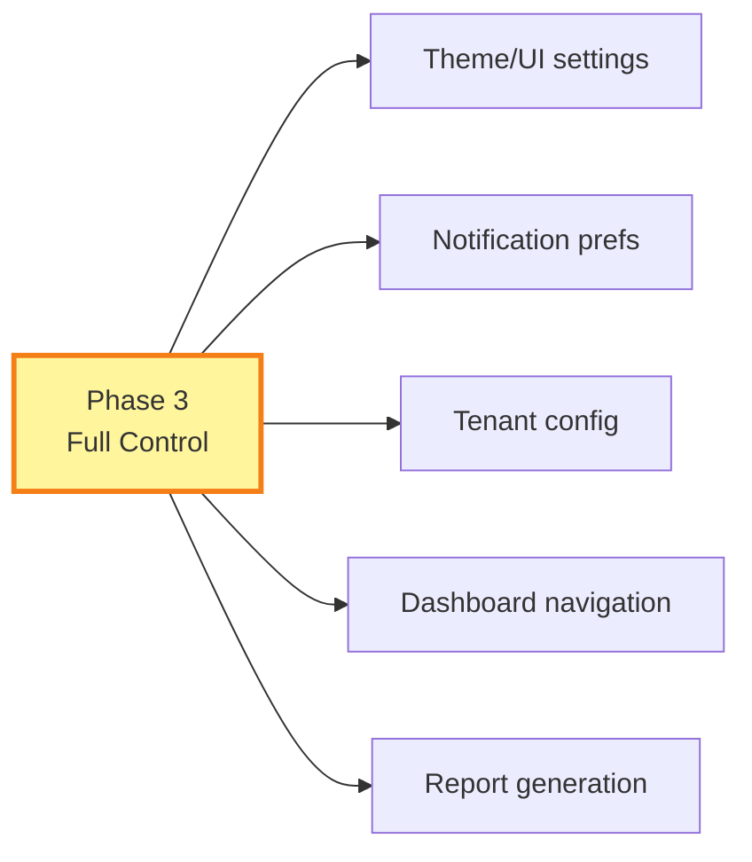

# VALIS Universal Interface

## The Vision

**Every action you can take in the ARM UI, you should also be able to do by talking to VALIS.**

VALIS is not just a query tool. It's a **universal natural language interface** that sits on top of the entire ARM platform. Want to check your Kanban board? Ask VALIS. Want to spawn a new agent? Tell VALIS. Want to switch to dark mode? Just say so. Want a performance report? Ask for it in plain English.

The ARM dashboard remains the visual cockpit — the place for charts, graphs, drag-and-drop, and complex layouts. But VALIS is the copilot: anything the cockpit can do, VALIS can do for you when you ask.

---

## Core Principle

> **If a button exists in the UI, VALIS should be able to press it for you.**

This applies to:
- **Reading data** — agent status, task boards, activity feeds, analytics
- **Taking actions** — spawning agents, assigning tasks, approving decisions, resolving escalations
- **Changing settings** — dark mode, notification preferences, dashboard layout
- **Getting reports** — performance summaries, weekly rollups, trend analysis
- **Managing workflows** — pausing agents, reassigning tasks, cancelling work, broadcasting messages

---

## What Talking to VALIS Looks Like

### Reading Data (Phase 1)

| You say... | VALIS does... |
|-----------|--------------|
| "What's MarketingBot working on?" | Queries tasks assigned to MarketingBot, returns status summary |
| "Show me the Kanban board" | Fetches all tasks grouped by status, formats as text columns |
| "Any escalations I need to handle?" | Queries open escalations for the tenant, prioritized by urgency |
| "How are my agents performing this week?" | Pulls analytics_daily data, compares agent velocity |
| "What happened while I was away?" | Gets recent activity feed entries, summarizes key events |
| "List all blocked tasks" | Queries tasks with status=blocked, includes blocker context |
| "Who's idle right now?" | Queries agents with status=idle, lists them with last activity time |

### Taking Actions (Phase 2)

| You say... | VALIS does... |
|-----------|--------------|
| "Spawn a new marketing agent" | Creates agent with role=worker, type=marketing, prompts for details if needed |
| "Assign the newsletter task to ContentBot" | Updates task's assigned_agent_id |
| "Approve the Q4 budget decision" | Sets decision status to approved, logs activity |
| "Pause SalesBot" | Sets agent status to paused, logs activity |
| "Stop all idle agents" | Bulk status update, requires confirmation first |
| "Create a task: research competitor pricing" | Creates task in queued status, assigns to appropriate agent |
| "Resolve the billing escalation — customer was refunded" | Resolves escalation with resolution note |
| "Reassign all of AnalyticsBot's tasks to DataBot" | Bulk task reassignment with confirmation |
| "Cancel the Q1 report task" | Sets task status to cancelled |
| "Send a message to all managers: weekly sync at 3pm" | Broadcasts message to agents with role=manager |

### Settings & UI Control (Phase 3)

| You say... | VALIS does... |
|-----------|--------------|
| "Switch to dark mode" | Toggles theme preference |
| "Turn off email notifications" | Updates user notification settings |
| "Show me the agent view" | Navigates dashboard to agent roster |
| "Expand the activity feed" | Adjusts UI layout |
| "Set my default view to the Kanban board" | Updates user preference |
| "Increase the escalation SLA to 8 hours" | Updates tenant configuration |

---

## Architecture

### How VALIS Processes a Request



### VALIS Engine Components



---

## The Safeguard System

This is critical. VALIS has the power to do anything in the system, so we need guardrails.

### Risk Levels

Every VALIS action is classified into one of four risk levels:

| Risk Level | Confirmation | Examples |
|-----------|:-----------:|---------|
| **NONE** | No | Read queries, status checks, viewing data |
| **LOW** | No | Create a task, send a message, change theme |
| **MEDIUM** | Yes (single) | Pause an agent, reassign a task, approve a decision |
| **HIGH** | Yes (explicit) | Stop/terminate an agent, bulk operations, delete tasks, change tenant settings |
| **CRITICAL** | Yes + reason | Terminate all agents, purge data, modify security settings |

### Safeguard Rules



### Safeguard Action Classification

| Action Category | Risk Level | Confirmation Style |
|----------------|-----------|-------------------|
| **Read queries** (status, tasks, activities, analytics) | NONE | None |
| **View changes** (dark mode, layout, navigation) | LOW | None |
| **Create** (new task, new message) | LOW | None |
| **Assign/reassign** (task to agent) | MEDIUM | Yes/No |
| **Status changes** (pause agent, complete task) | MEDIUM | Yes/No |
| **Approve/reject** (decisions, escalations) | MEDIUM | Yes/No |
| **Stop/terminate** (agent termination) | HIGH | Type CONFIRM |
| **Bulk operations** (stop all idle agents) | HIGH | Type CONFIRM |
| **Delete** (remove task, cancel multiple tasks) | HIGH | Type CONFIRM |
| **Tenant settings** (SLA changes, config changes) | HIGH | Type CONFIRM |
| **Bulk terminate** (stop all agents) | CRITICAL | Type action name |
| **Security changes** (auth settings, API keys) | CRITICAL | Type action name |

### Additional Safeguards

1. **Confidence Threshold** — If VALIS's intent classification confidence is below 0.8, it asks for clarification instead of acting:
   > "I'm not sure if you want me to pause MarketingBot or stop it entirely. Which one?"

2. **Undo Window** — For MEDIUM-risk actions, VALIS offers an undo for 30 seconds:
   > "SalesBot paused. Say 'undo' within 30 seconds to reverse this."

3. **Rate Limiting** — Maximum 10 write actions per minute, 3 HIGH-risk actions per hour

4. **Scope Limiting** — VALIS refuses requests that affect other tenants (RLS enforces this at the DB level too, but VALIS explicitly checks)

5. **Audit Trail** — Every VALIS action creates an activity record with:
   - `actor_type: 'system'`
   - `actor_id: valis_agent_id`
   - `metadata: { initiated_by: user_id, natural_language_input: "...", confidence: 0.95 }`

6. **Deny List** — Some actions VALIS can never do, even if asked:
   - Delete the tenant
   - Modify RLS policies
   - Access other tenant data
   - Modify its own permissions
   - Bypass confirmation requirements

---

## VALIS Capabilities by Domain

### Agents

| Capability | Phase | Risk |
|-----------|-------|------|
| List all agents | 1 | NONE |
| Get agent status | 1 | NONE |
| Get agent's tasks | 1 | NONE |
| View agent hierarchy | 1 | NONE |
| Spawn new agent | 2 | LOW |
| Pause agent | 2 | MEDIUM |
| Resume agent | 2 | MEDIUM |
| Terminate agent | 2 | HIGH |
| Terminate all agents | 2 | CRITICAL |
| Change agent config | 3 | HIGH |

### Tasks

| Capability | Phase | Risk |
|-----------|-------|------|
| List tasks (with filters) | 1 | NONE |
| View Kanban board state | 1 | NONE |
| Get task details | 1 | NONE |
| View task dependencies | 1 | NONE |
| Create task | 2 | LOW |
| Assign task to agent | 2 | MEDIUM |
| Reassign task | 2 | MEDIUM |
| Update task priority | 2 | LOW |
| Complete/cancel task | 2 | MEDIUM |
| Bulk cancel tasks | 2 | HIGH |

### Decisions & Escalations

| Capability | Phase | Risk |
|-----------|-------|------|
| List pending decisions | 1 | NONE |
| View decision details | 1 | NONE |
| List open escalations | 1 | NONE |
| Approve/reject decision | 2 | MEDIUM |
| Override decision | 2 | HIGH |
| Resolve escalation | 2 | MEDIUM |

### Activity & Analytics

| Capability | Phase | Risk |
|-----------|-------|------|
| View recent activity | 1 | NONE |
| Search activities | 1 | NONE |
| Get performance summary | 1 | NONE |
| Get agent comparison | 1 | NONE |
| Generate weekly report | 1 | NONE |
| Export analytics | 2 | LOW |

### Messages

| Capability | Phase | Risk |
|-----------|-------|------|
| View conversations | 1 | NONE |
| Send message to agent | 2 | LOW |
| Broadcast to role | 2 | MEDIUM |
| Broadcast to all | 2 | HIGH |

### Settings & UI

| Capability | Phase | Risk |
|-----------|-------|------|
| Toggle dark/light mode | 3 | LOW |
| Change notification settings | 3 | MEDIUM |
| Update dashboard layout | 3 | LOW |
| Modify tenant settings | 3 | HIGH |
| Change escalation SLA | 3 | HIGH |

---

## Conversation Design

VALIS should feel like talking to a competent assistant, not a rigid command parser. Some design principles:

### 1. Context Awareness

VALIS remembers conversation context within a session:

```
User: "How's MarketingBot doing?"
VALIS: "MarketingBot is active, working on 'Q1 Email Campaign' (75% done).
        2 tasks queued: LinkedIn content and blog post draft."

User: "Pause it"
VALIS: "I'll pause MarketingBot. Its 'Q1 Email Campaign' task will move to
        blocked. Continue? [Yes/No]"

User: "Yes"
VALIS: "Done. MarketingBot is paused. Say 'resume MarketingBot' when ready."
```

Notice: "Pause **it**" — VALIS knows "it" refers to MarketingBot from context.

### 2. Progressive Disclosure

VALIS gives concise answers but offers to go deeper:

```
User: "What's blocked?"
VALIS: "3 tasks are blocked:
        1. Deploy to Production — waiting on QA Sign-off
        2. API Integration — waiting on vendor API key
        3. Data Migration — depends on Schema Redesign (in progress, 40%)
        Want details on any of these?"

User: "Tell me more about #3"
VALIS: "Data Migration is assigned to DataBot. It's blocked because its
        dependency 'Schema Redesign' (assigned to ArchitectBot) is still
        in progress at 40%. Estimated unblock: when Schema Redesign
        completes. Want me to check with ArchitectBot on the timeline?"
```

### 3. Proactive Suggestions

When VALIS detects something actionable, it suggests:

```
User: "Show me agent performance this week"
VALIS: "This week's performance:
        • ContentBot: 12 tasks completed, avg 2.1 hrs each ✓
        • SalesBot: 8 tasks completed, avg 3.4 hrs each ✓
        • DataBot: 2 tasks completed, 4 blocked ⚠️

        DataBot seems stuck — 4 tasks blocked on the same dependency.
        Want me to escalate this or reassign the blocking task?"
```

### 4. Graceful Degradation

When VALIS can't do something, it explains and offers alternatives:

```
User: "Show me the revenue chart"
VALIS: "I can't display charts in the chat — but I can tell you the numbers.
        This week's revenue metrics:
        • Total: $42,350 (+12% vs last week)
        • Avg deal size: $2,117
        • Deals closed: 20

        For the visual chart, here's a link to your dashboard:
        [Open Revenue Dashboard →]"
```

---

## Three-Phase Rollout

### Phase 1: Read-Only Queries (Post-MVP Launch)

**Goal:** VALIS answers any question about the system in natural language.



**Milestones:**
- [ ] LLM intent classifier (status_query, task_query, activity_query, analytics_query, escalation_query)
- [ ] Entity extractor (agent names → IDs, status filters, date ranges)
- [ ] Intent handlers calling existing API endpoints
- [ ] Response synthesizer (JSON → conversational text)
- [ ] VALIS chat panel in ARM dashboard
- [ ] Conversation session management (context memory)
- [ ] Test suite: 50+ example queries with expected intent classifications

### Phase 2: Action Commands (Months 2-3)

**Goal:** VALIS can take actions on your behalf with appropriate safeguards.



**Milestones:**
- [ ] Write-action intent handlers (spawn, pause, assign, approve, etc.)
- [ ] Safeguard layer with risk classification
- [ ] Confirmation flow (Yes/No, CONFIRM, exact-match)
- [ ] Undo system for medium-risk actions (30-second window)
- [ ] Bulk action support with explicit confirmation
- [ ] Action audit trail (VALIS-initiated activities tagged with NL input)

### Phase 3: Settings & Full Control (Months 4-6)

**Goal:** VALIS is a complete interface to the entire platform.



**Milestones:**
- [ ] Client-side action bridge (VALIS → React state for theme, layout, navigation)
- [ ] Settings mutation handlers
- [ ] Tenant configuration changes with HIGH-risk safeguards
- [ ] Dashboard navigation commands ("show me the agent view")
- [ ] Report generation and export ("email me the weekly summary")

---

## VALIS Chat UI

The VALIS chat panel is embedded in the ARM dashboard as a persistent side panel or overlay.

### UI Concepts

- **Persistent chat icon** in bottom-right corner (like Intercom, but for your own AI)
- **Side panel** that slides open — doesn't replace the dashboard
- **Keyboard shortcut** — press `/` or `Cmd+K` to focus VALIS input
- **Rich responses** — VALIS responses can include:
  - Formatted text (bold, lists, code)
  - Mini data tables (inline agent status, task lists)
  - Action buttons (when confirmation is needed: "Yes / No" buttons)
  - Links to dashboard views ("View in Kanban →")
- **Conversation history** — scrollable, searchable, persisted per session
- **Voice input** (future) — press-and-hold to speak to VALIS

### Chat Message Types

| Type | Example | Rendering |
|------|---------|-----------|
| **User text** | "What's blocked?" | Plain text bubble |
| **VALIS text** | "3 tasks are blocked..." | Rich text with formatting |
| **VALIS data** | Task list, agent status | Mini table or card layout |
| **Confirmation** | "Pause SalesBot? [Yes/No]" | Text + action buttons |
| **Link** | "View in dashboard →" | Clickable link to ARM page |
| **Error** | "I can't do that because..." | Error-styled message |
| **System** | "VALIS is thinking..." | Loading indicator |

---

## Technical Implementation Notes

### LLM Integration

- **Provider-agnostic** — VALIS uses the LLM Router (Claude, GPT-4, Gemini, local models)
- **Structured output** — LLM returns JSON with `{ intent, entities, confidence }`, not free text
- **System prompt** — Defines all available intents, entity types, and output format
- **Few-shot examples** — Include 20-30 example classifications in the system prompt
- **Token budget** — Keep conversation context to last 10 messages to control costs
- **Streaming** — Stream responses token-by-token for perceived speed

### API Layer

VALIS calls the same ARM API endpoints as the UI:
- Same authentication (JWT with tenant context)
- Same RLS enforcement
- Same Zod validation
- Same activity logging

This means: no new security surface. VALIS is just another API client.

### Session Management

- Sessions stored in `agent_sessions` table (already exists)
- Each session: user_id, tenant_id, conversation_history (JSONB), created_at, expires_at
- Sessions expire after 1 hour of inactivity
- Conversation history is summarized after 20 messages to keep token usage manageable

### Error Handling

When VALIS can't fulfill a request:
1. **Ambiguous intent** → Ask for clarification
2. **Missing entity** → Ask for the specific entity ("Which agent?")
3. **Permission denied** → Explain why and suggest alternative
4. **API error** → Translate to human-friendly error
5. **Low confidence** → Show top 2-3 interpretations and ask user to pick

---

## Open Questions

- [ ] Which LLM to use for intent classification? (Claude is natural choice, but cost/latency tradeoffs)
- [ ] Should VALIS have a personality/name displayed in the UI, or stay generic?
- [ ] How to handle VALIS actions in multi-channel context? (Same safeguards across Telegram, Slack, etc.?)
- [ ] Should VALIS proactively notify? ("Hey, DataBot has been blocked for 2 hours — want me to check?")
- [ ] What's the token budget per conversation turn? (Controls LLM cost)
- [ ] Should we offer a "VALIS-only" mode for power users who prefer NL over clicking?
- [ ] How do we test VALIS? (Intent classification accuracy benchmarks, action correctness tests)

---

## Related Documentation

- [[visual/13-valis-meta-agent|VALIS Architecture Diagrams]] — Existing technical design
- [[future/02-multi-channel-access|Multi-Channel Access]] — Extending VALIS to Telegram, Discord, etc.
- [[ARCHITECTURE]] — System architecture and design patterns
- [[AGENT-PROTOCOL]] — Agent communication protocol
- [[visual/11-api-architecture|API Architecture]] — Endpoints VALIS will call
