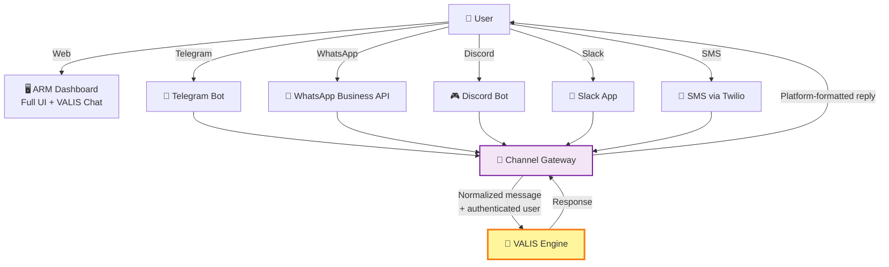

# Multi-Channel VALIS Access

## The Idea

Users should be able to talk to VALIS from **any communication app** — Telegram, WhatsApp, Discord, Slack, SMS — not just the ARM web dashboard. Quick status checks, approvals, and commands happen from wherever the user already is. The ARM UI remains the go-to for visual dashboards and complex workflows.

**Inspired by:** [OpenClaw](https://openclaw.com) — multi-channel AI agent access

---

## Why This Matters

- **Meet users where they are** — solopreneurs live in messaging apps
- **Faster response loop** — ask "what's blocked?" from your phone without opening a browser
- **Lower friction** — no need to learn a new UI for basic interactions
- **Mobile-first** — messaging apps work better on mobile than web dashboards
- **Always-on** — VALIS is available in the app you already have open

---

## Architecture

### Channel Gateway

The gateway is the new component that:
1. **Receives** messages from each platform's webhook
2. **Authenticates** by mapping platform identity → ARM user
3. **Normalizes** into standard VALIS message format
4. **Routes** to VALIS engine
5. **Formats** response for the platform (Telegram markdown, Slack Block Kit, etc.)
6. **Replies** through the same channel

### Channel Capabilities

| Channel | Text | Rich Formatting | Images | Buttons | Push Alerts |
|---------|:----:|:---------------:|:------:|:-------:|:-----------:|
| ARM UI | Full | Full | Full | Full | Full |
| Telegram | Yes | Markdown | Yes | Inline keyboards | Yes |
| WhatsApp | Yes | Limited | Yes | Quick replies | Yes |
| Discord | Yes | Embeds | Yes | Buttons | Yes |
| Slack | Yes | Block Kit | Yes | Interactive | Yes |
| SMS | Yes | None | No | No | Yes |

---

## User Linking

One-time setup to connect a messaging account to ARM:

1. User goes to ARM → Settings → Connected Channels
2. Selects platform (e.g., Telegram)
3. ARM generates a one-time link code
4. User sends code to the bot on that platform
5. Bot verifies code, links platform user ID → ARM user ID + tenant ID
6. Done — future messages from that platform user are authenticated

---

## Safeguards Across Channels

The same [[future/01-valis-universal-interface|safeguard system]] applies on every channel:
- Read queries: no confirmation needed
- Write actions: confirmation required (user replies "yes" or taps confirm button)
- High-risk actions: explicit confirmation ("type CONFIRM")
- Audit trail tags every action with the channel it came from

---

## Implementation Notes

- Each channel adapter is a **Supabase Edge Function** (webhook receiver)
- Rate limiting: per-channel, per-user
- Conversation state persisted in `agent_sessions` (same as web VALIS)
- If a query needs visual output, VALIS replies with a dashboard link
- Start with **Telegram + Slack** (easiest APIs, best bot ecosystems)

---

## Open Questions

- [ ] Which channels to prioritize first?
- [ ] Build custom gateway or use a platform like Botpress/Chatwoot?
- [ ] How to handle multi-tenant user linking securely?
- [ ] Per-channel rate limiting strategy?
- [ ] Should channel bots have different VALIS capabilities? (e.g., no HIGH-risk actions via SMS?)

---

## Depends On

- [[future/01-valis-universal-interface|VALIS Universal Interface]] Phase 1 must be complete first

## Related

- [[visual/13-valis-meta-agent|VALIS Architecture]] — Core VALIS design
- [[ARCHITECTURE]] — System architecture
