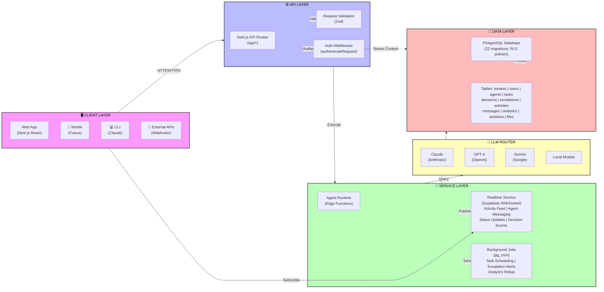
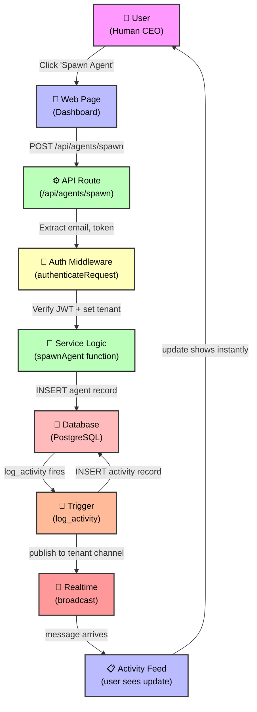
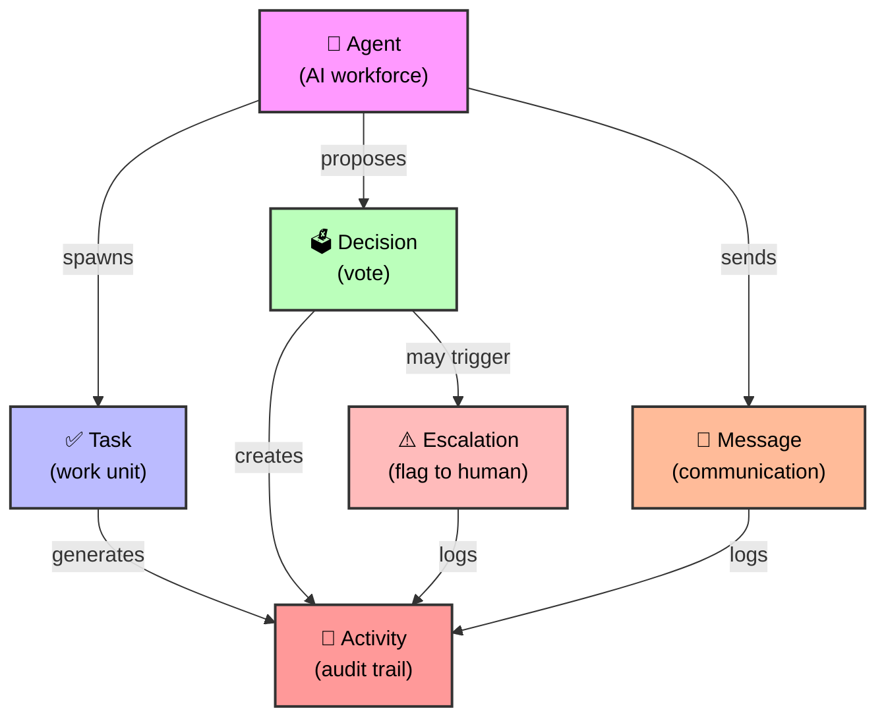

# System Overview

## What is the ARM System?

Pink Beam ARM is built on a modern, scalable architecture that runs on **Next.js 16 + React 19** on the frontend, **Supabase PostgreSQL** for data, and **Vercel Edge Functions** for serverless compute. The system is designed as a multi-tenant, event-driven platform where humans spawn and manage hierarchies of AI agents.

At its core, ARM is a **command center** with:
- Real-time activity feeds showing what agents are doing
- A messaging system for human-agent and agent-agent communication
- Collective decision-making where agents propose and vote
- Task assignment and tracking
- Escalation to humans when things get risky
- Full audit trails of who did what and when

---

## The 4-Layer Architecture

### Layer Breakdown

**CLIENT LAYER** — Where users interact with the system
- **Web App**: React/Next.js dashboard where humans monitor agents, make decisions, handle escalations
- **Mobile**: Planned for future (push notifications, quick decisions on the go)
- **CLI**: Claude (or any LLM) can query ARM via API
- **External APIs**: Webhooks allow external systems to trigger agent tasks

**API LAYER** — Request handling and security
- **Next.js API Routes**: All requests go through `/api/*` routes
- **Auth Middleware**: Every request is validated; `authenticateRequest()` returns tenant + user context
- **Request Validation**: Zod schemas ensure only valid data enters the system

**SERVICE LAYER** — Business logic execution
- **Agent Runtime**: Edge Functions execute agent behavior (reasoning, decision-making, task execution)
- **Realtime Service**: Supabase WebSocket broadcasts activity feeds, agent status updates, decision votes
- **Background Jobs**: `pg_cron` handles scheduled work (escalation alerts, analytics rollup, task scheduling)

**DATA LAYER** — Persistent storage
- **PostgreSQL**: 22 migrations define schema with Row-Level Security (RLS) for multi-tenant isolation
- **Core Tables**: All data is partitioned by `tenant_id` for complete isolation
- Every operation is auditable through the `activities` table

---

## How a Request Flows Through the System

### Request Flow Walkthrough

1. **User Action** — Human clicks "Spawn Agent" on dashboard
2. **HTTP Request** — Browser sends `POST /api/agents/spawn` with agent config
3. **Route Handler** — Next.js route receives request and extracts authentication
4. **Auth Middleware** — `authenticateRequest()` validates JWT token and identifies tenant
5. **Service Logic** — Business logic executes (e.g., spawn agent function)
6. **Database Write** — Agent record is inserted with `tenant_id` and other fields
7. **Trigger Fires** — PostgreSQL `log_activity()` trigger automatically fires
8. **Activity Logged** — New record added to `activities` table
9. **Realtime Broadcast** — Supabase publishes event to WebSocket channel `tenant:{id}`
10. **Push to Client** — Activity Feed component receives real-time update
11. **UI Renders** — User sees new agent appear instantly (no page refresh needed)

**Key Principle**: Every state change is an event. Every event is logged. Users see changes in real-time.

---

## Component Relationships

---

## Key Takeaways

✅ **Multi-layer design** separates concerns: clients stay thin, API is stateless, services are scalable, data is isolated

✅ **Every action is an event** — State changes trigger audit logs and real-time broadcasts

✅ **Tenant isolation is built-in** — RLS policies enforce that one tenant can never see another's data

✅ **Real-time by default** — Users see activity feeds, agent statuses, and decision votes as they happen

✅ **Serverless + managed services** — No servers to manage; scales automatically with Vercel + Supabase

---

## Architecture Principles

| Principle | What It Means |
|-----------|---------------|
| **Stateless** | API routes don't hold session state; all state is in the database |
| **Event-driven** | State changes fire events that get logged and broadcast |
| **Tenant-first** | Every table has `tenant_id`; queries always filter by tenant |
| **Audit trail** | Every change is logged in `activities` with who, what, when |
| **Real-time** | Supabase Realtime keeps clients synchronized instantly |
| **Type-safe** | Full TypeScript with strict mode; Zod validates at boundaries |

---

## Related Documentation

- **[[ARCHITECTURE|Full Architecture Docs]]** — Detailed technical decisions
- **[[02-auth-flow|Authentication Flow]]** — How users log in
- **[[03-multi-tenancy|Multi-Tenancy Deep Dive]]** — RLS policies and tenant isolation
- **[[06-data-model|Data Model]]** — Complete schema
- **[[11-api-architecture|API Architecture]]** — Middleware and request handling
- **[[14-deployment|Deployment]]** — Infrastructure and scaling

---

## Next Steps

Once you understand the 4 layers, read **[[02-auth-flow|Authentication Flow]]** to see how users get started, then **[[04-agent-hierarchy|Agent Hierarchy]]** to understand how agents organize themselves.

Last updated: 2026-02-15
