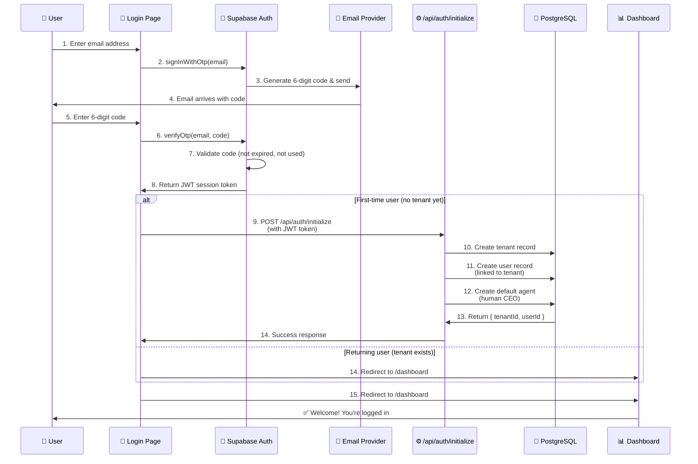
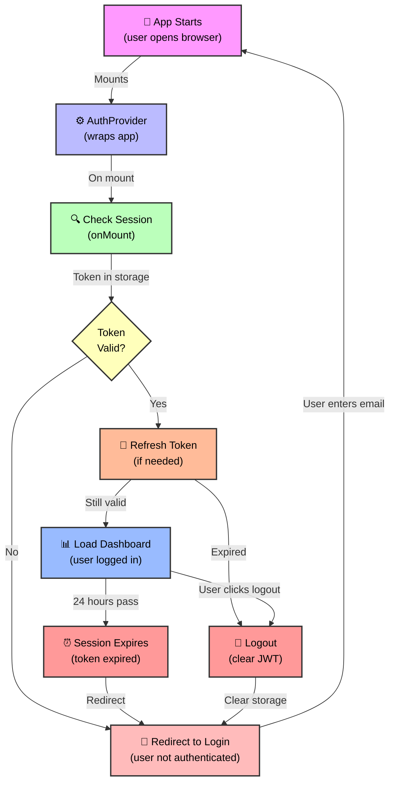

# Authentication Flow

## How Users Sign In

Pink Beam ARM uses **OTP (One-Time Password) authentication**. There are no magic links, no passwords to remember, no complex multi-factor setup. Users enter their email, receive a 6-digit code via email, enter the code, and they're logged in.

This flow is:
- **Secure** — Codes expire in 10 minutes; single-use only
- **User-friendly** — No passwords to forget
- **Tenant-aware** — First-time users automatically get a new tenant and workspace

---

## OTP Login Flow



### Step-by-Step Walkthrough

**Steps 1-4: Request OTP**
- User enters their email on the login page
- Page calls `signInWithOtp(email)` from Supabase Auth client
- Supabase generates a random 6-digit code
- Email provider (Resend, SendGrid, etc.) sends code to user's email
- User receives email within seconds

**Steps 5-8: Verify OTP**
- User enters the 6-digit code into the login page
- Page calls `verifyOtp(email, code)` to Supabase Auth
- Supabase validates: code matches email, not expired (10 min window), not already used
- If valid, Supabase returns a JWT session token
- Token contains user identity and is signed by Supabase

**Steps 9-14: Initialize Tenant (First-time Users Only)**
- If this is the first login, JWT is sent to `/api/auth/initialize`
- Server-side logic creates a new tenant record (representing the workspace)
- Creates a user record linked to the tenant
- Creates a default agent (the human CEO who owns this workspace)
- Returns `{ tenantId, userId }` to the client

**Step 15: Redirect to Dashboard**
- Client stores JWT in secure HttpOnly cookie or browser storage
- User is redirected to `/dashboard`
- AuthProvider component verifies session is valid
- Dashboard loads and user sees their workspace

---

## Session Lifecycle



### Session Management Details

1. **App Starts** — User opens ARM in their browser
2. **AuthProvider Mounts** — React component loads and checks if user is authenticated
3. **Check Session** — AuthProvider looks for JWT in browser storage
4. **Validate Token** — If JWT found, check expiration and signature
5. **Refresh if Needed** — If token is stale but still valid, refresh it with Supabase
6. **Load Dashboard** — If valid, render dashboard and protected pages
7. **Redirect if Not Logged In** — If no valid token, send user to login page
8. **Auto-Logout** — If session expires (default 24 hours), clear storage and redirect to login
9. **Manual Logout** — User can click logout button to clear session immediately

---

## Key Files and Components

### Frontend

**`src/components/auth/AuthProvider.tsx`** — Main authentication context provider
- Wraps entire app
- Checks session on mount
- Provides `useAuth()` hook for components
- Handles token refresh logic
- Redirects unauthenticated users to `/login`

```tsx
// Usage in components
const { user, tenantId, isLoading } = useAuth();

if (isLoading) return <Spinner />;
if (!user) return <Redirect to="/login" />;

return <Dashboard />;
```

**`src/app/login/page.tsx`** — Login page
- Email input field
- OTP code input field
- Calls `signInWithOtp()` and `verifyOtp()` from Supabase

### Backend

**`src/app/api/auth/initialize/route.ts`** — Tenant & user initialization (first-time users only)
- Validates JWT token from request
- Checks if user already has a tenant (to prevent re-initialization)
- Creates tenant record
- Creates user record linked to tenant
- Creates default agent (human CEO)
- Returns tenant ID and user ID

```ts
// Called only once per user
POST /api/auth/initialize
Authorization: Bearer {JWT_TOKEN}

Response:
{
  "tenantId": "uuid",
  "userId": "uuid",
  "success": true
}
```

---

## Environment Variables Required

```env
# Supabase authentication
NEXT_PUBLIC_SUPABASE_URL=https://your-project.supabase.co
NEXT_PUBLIC_SUPABASE_ANON_KEY=eyJhbGc...

# Server-side only (for protected routes and server actions)
SUPABASE_SERVICE_ROLE_KEY=eyJhbGc...

# App configuration
NEXT_PUBLIC_APP_URL=http://localhost:3000
```

| Variable | Where Used | Purpose |
|----------|-----------|---------|
| `NEXT_PUBLIC_SUPABASE_URL` | Client + Server | Supabase project URL |
| `NEXT_PUBLIC_SUPABASE_ANON_KEY` | Client | Limited permissions (RLS enforced) |
| `SUPABASE_SERVICE_ROLE_KEY` | Server only | Bypass RLS for trusted operations |
| `NEXT_PUBLIC_APP_URL` | Client | Used for redirects and links |

---

## Security Considerations

### What We Protect

✅ **JWT tokens are HttpOnly cookies** — Cannot be stolen by JavaScript/XSS attacks
✅ **OTP codes expire in 10 minutes** — Codes sent via email are single-use
✅ **RLS policies enforce tenant isolation** — Even if someone steals a token, they can only access their own tenant's data
✅ **Service role key never leaves the server** — Only used in `/api` routes with backend validation
✅ **CSRF protection via Supabase** — Built-in CSRF token handling

### What We Don't Do

❌ No plaintext passwords stored anywhere
❌ No magic links that can be forwarded
❌ No pre-filled login forms vulnerable to phishing
❌ No client-side secret keys exposed in bundle
❌ No session data stored in LocalStorage (only in HttpOnly cookies)

---

## Multi-Tenancy Integration

The authentication flow automatically sets up multi-tenancy:

```mermaid
graph LR
    USER["👤 User<br/>alice@example.com"]
    JWT["🔐 JWT Token<br/>(contains user_id)"]
    ROUTE["⚙️ API Route"]
    AUTH["🔐 authenticateRequest()"]
    TENANT["🏢 Set Tenant Context<br/>(set_tenant_context)"]
    DB["💾 Query with filter<br/>WHERE tenant_id = current_setting"]

    USER -->|Login| JWT
    JWT -->|Every request| ROUTE
    ROUTE -->|Validate| AUTH
    AUTH -->|Extract tenant_id| TENANT
    TENANT -->|PostgreSQL session var| DB
    DB -->|RLS policy prevents<br/>cross-tenant access| DB

    style USER fill:#f9f,stroke:#333,stroke-width:2px,color:#000
    style JWT fill:#bbf,stroke:#333,stroke-width:2px,color:#000
    style ROUTE fill:#bfb,stroke:#333,stroke-width:2px,color:#000
    style AUTH fill:#ffb,stroke:#333,stroke-width:2px,color:#000
    style TENANT fill:#fb9,stroke:#333,stroke-width:2px,color:#000
    style DB fill:#fbb,stroke:#333,stroke-width:2px,color:#000
```



When a user logs in:
1. JWT contains their `user_id`
2. Every API request includes JWT in Authorization header
3. `authenticateRequest()` middleware validates JWT and looks up user's `tenant_id`
4. Tenant ID is set in PostgreSQL session variable (`set_tenant_context`)
5. All database queries include `WHERE tenant_id = current_setting('app.current_tenant')`
6. RLS (Row-Level Security) policies prevent queries from crossing tenant boundaries

**Result**: Even if someone has valid credentials, they can only see and modify their own tenant's data.

---

## Flows Diagram

### New User Sign-Up

```
Email Entry → OTP Sent → Code Verification → Initialize Tenant → Create User → Create Agent → Dashboard
```

### Returning User Login

```
Email Entry → OTP Sent → Code Verification → Dashboard
```

### Session Refresh (background)

```
Token near expiration → Refresh endpoint → New token issued → Continue using app
```

### Logout

```
Click Logout → Clear storage → Clear cookies → Redirect to login
```

---

## Related Documentation

- **[[01-system-overview|System Overview]]** — How auth fits into the 4-layer architecture
- **[[03-multi-tenancy|Multi-Tenancy Architecture]]** — How tenant_id is used throughout the system
- **[[11-api-architecture|API Architecture]]** — The `authenticateRequest()` middleware
- **[[ARCHITECTURE|Full Architecture Docs]]** — Technical decision details
- **Supabase Auth Docs** — https://supabase.com/docs/guides/auth

---

## Key Takeaways

✅ **OTP is secure and user-friendly** — No passwords, easy to use, hard to compromise

✅ **First-time setup is automatic** — New users get a tenant and workspace automatically

✅ **Sessions are managed server-side** — Tokens are HttpOnly, never exposed to JavaScript

✅ **Multi-tenancy is baked in** — Tenant isolation starts at authentication

✅ **RLS provides defense-in-depth** — Even if auth is compromised, database protects data

---

## Testing the Auth Flow Locally

```bash
# Start the dev server
npm run dev

# Navigate to http://localhost:3000/login
# Enter any test email (e.g., test@example.com)
# Check terminal for OTP code (printed for local development)
# Or check Supabase dashboard for the code
# Enter code and verify
# On first login, /api/auth/initialize creates tenant + user
# You're redirected to /dashboard
```

---

Last updated: 2026-02-15
