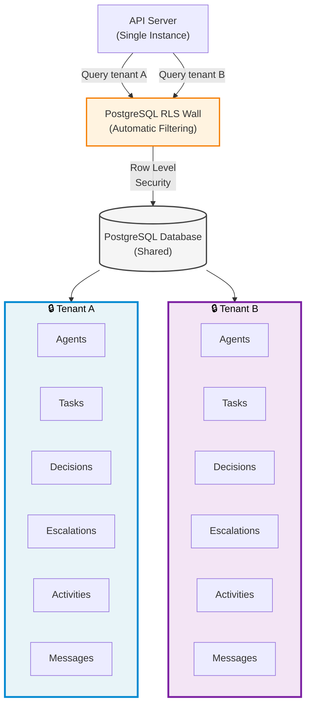
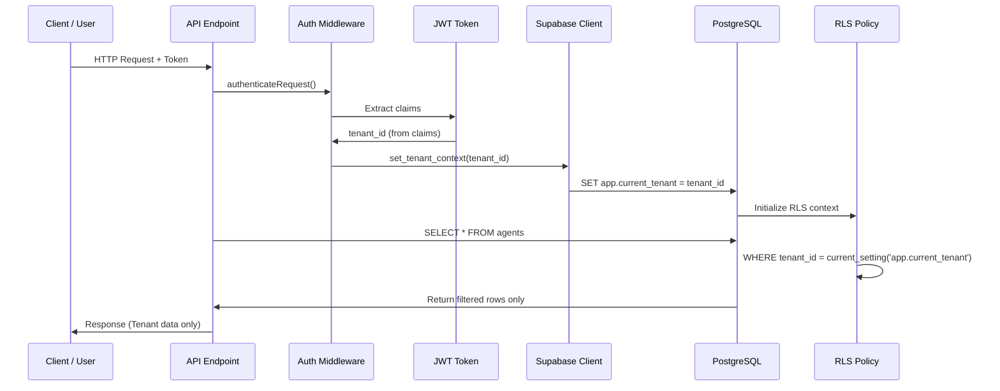
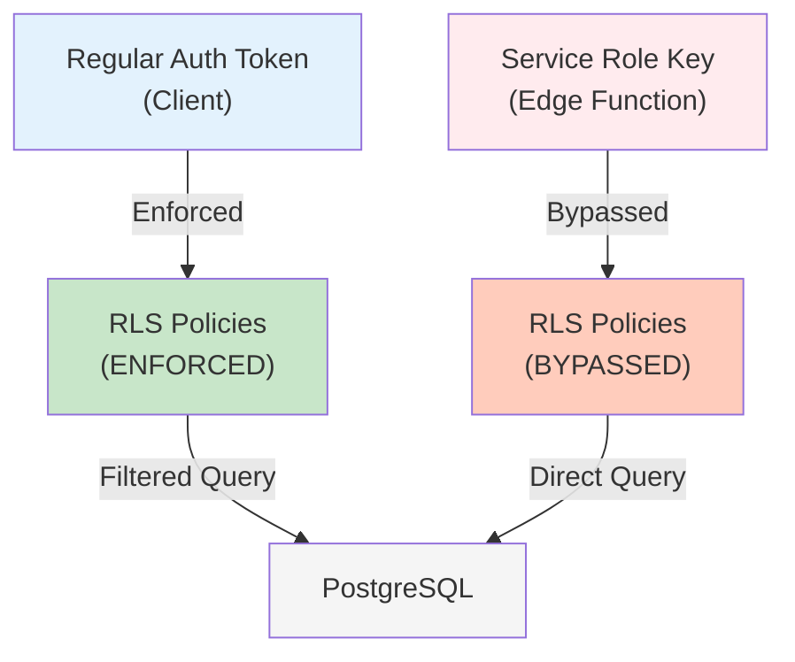

# Multi-Tenancy Model

## Overview

Pink Beam ARM is a **multi-tenant system** where multiple organizations (tenants) operate independently on the same infrastructure. Complete data isolation is enforced at the database level using PostgreSQL Row Level Security (RLS) policies. Every table has a `tenant_id` column, and RLS automatically filters queries so that tenants can only see their own data. This means the same API, running once, securely serves all customers.

---

## System Architecture

The diagram below shows how two separate tenants (Tenant A and Tenant B) are isolated despite sharing the same PostgreSQL database and API server:



**Key Points:**
- Same API server handles requests from both tenants
- PostgreSQL RLS policies automatically filter rows by `tenant_id`
- Tenant A queries return *only* Tenant A data
- Tenant B queries return *only* Tenant B data
- Cross-tenant data access is **impossible by design**

---

## Tenant Context Flow

This sequence diagram shows how tenant context is established and enforced for every request:



**Flow Explanation:**
1. **Request arrives** with JWT token containing tenant_id in claims
2. **Auth middleware** validates the token and extracts tenant_id
3. **Supabase context** is set with `set_tenant_context(tenant_id)`
4. **PostgreSQL receives** `SET app.current_tenant = tenant_id` command
5. **All subsequent queries** are automatically filtered by RLS policies
6. **Results** are returned containing only the requesting tenant's data

---

## RLS Policy Pattern

Every table uses the same RLS policy pattern. Here's the PostgreSQL code pattern used across all tables:

```sql
-- Example: agents table RLS policy
CREATE POLICY tenant_isolation_policy ON agents
USING (tenant_id = current_setting('app.current_tenant')::uuid);

-- The USING clause means:
-- "Only show rows where tenant_id matches the current tenant from context"

-- This policy is applied to:
-- - agents, tasks, decisions, escalations, activities, messages
-- - users (within tenant scope)
-- - analytics_daily, files, agent_sessions
-- - All application tables
```

**How it works:**
- `current_setting('app.current_tenant')` retrieves the tenant_id set in step 4 above
- PostgreSQL casts it to UUID and compares it to the row's `tenant_id`
- Rows that don't match are **never returned**, even if the query structure would normally access them
- SELECT, UPDATE, DELETE operations all respect this policy

---

## Service Role Exception

For **Edge Functions and server-side operations**, the service role key bypasses RLS:



**When to use Service Role Key:**
- Edge Functions that need tenant-wide access
- Administrative operations
- Data backups or migrations
- Always verified with explicit tenant_id parameter

---

## Key Takeaways

✓ **Complete Isolation:** Every tenant's data is completely isolated from all others
✓ **Automatic Enforcement:** RLS policies run on *every query* automatically
✓ **No Manual Filtering:** Developers don't manually filter by tenant_id (RLS does it)
✓ **Cryptographic Safety:** Cross-tenant access is impossible without modifying the JWT itself
✓ **Scalable:** Add 100 tenants or 10,000—isolation logic remains the same
✓ **Transparent:** Application code works the same for all tenants; database handles the rest

---

## Related Documentation

- [[02-auth-flow]] — How authentication works and when tenant context is set
- [[06-data-model]] — Complete database schema with all tables and relationships
- [[ARCHITECTURE]] — Overall system design and multi-tenant patterns
