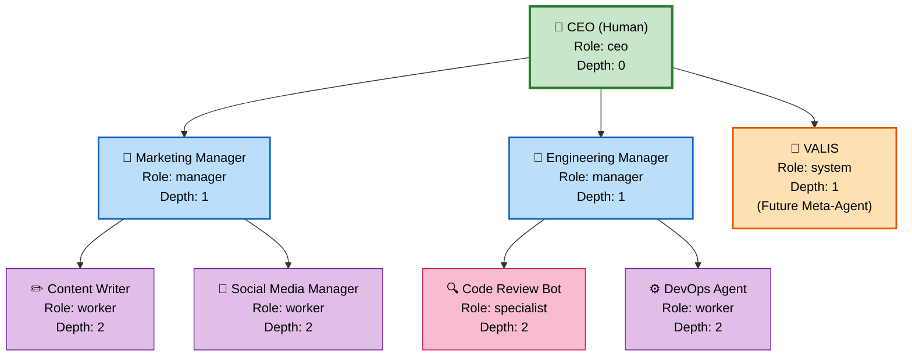

# Agent Hierarchy & Spawning

## Overview

Pink Beam ARM organizes agents in a **tree structure**, with humans at the root and agents spawning child agents below them. This creates an **agent workforce hierarchy**—similar to an organizational chart—where responsibility, authority, and capability cascade downward. Each agent has a role (CEO, Manager, Worker, Specialist, System) that determines what actions it can take.

---

## Example Agent Hierarchy

The diagram below shows a typical organizational structure with a human CEO at the root, management tiers, and specialized worker agents:



**Hierarchy Properties:**
- **Humans** are always at Depth 0 (root)
- **Child agents** are always owned by exactly one parent
- **Depth** increases by 1 for each level (managers at depth 1, workers at depth 2, etc.)
- **Any agent** can spawn children if its role allows (except workers and specialists)
- **Cycles are impossible** — the tree structure prevents feedback loops

---

## Role Capability Matrix

Each role has specific capabilities that control what actions it can take:

| **Capability** | **CEO** | **Manager** | **Worker** | **Specialist** | **System** |
|:---|:---:|:---:|:---:|:---:|:---:|
| **spawn** | ✅ Yes | ✅ Limited | ❌ No | ❌ No | ❌ No |
| **delegate** | ✅ Yes | ✅ Yes | ❌ No | ❌ No | ❌ No |
| **decide** | ✅ Yes | ✅ Scoped | ✅ Simple | ✅ Domain | ❌ No |
| **escalate** | ✅ Yes | ✅ Yes | ✅ Yes | ✅ Yes | ❌ No |
| **access_external** | ✅ Yes | ✅ Yes | ⚠️ Whitelisted | ✅ Relevant | ✅ Yes |
| **modify_config** | ✅ Yes | ✅ Children | ❌ No | ❌ No | ✅ Yes |

**Capability Definitions:**

- **spawn**: Create new child agents. CEOs can spawn any type; Managers can spawn workers/specialists only.
- **delegate**: Assign tasks to child agents. Requires manager+ role.
- **decide**: Make autonomous decisions. Workers make simple decisions; Specialists make domain-specific decisions; CEOs make any decision.
- **escalate**: Escalate a task/decision to a parent or human. All operational roles can escalate.
- **access_external**: Call external APIs/services. Workers need whitelisting; Specialists can access domain-relevant APIs; CEOs and System have full access.
- **modify_config**: Change configuration. Only CEOs can modify their children; System can modify anything.

---

## Agent Spawning Flow

When an agent requests permission to spawn a child, this sequence diagram shows the validation and initialization process:

```mermaid
sequenceDiagram
    participant PA as Parent Agent
    participant AR as Agent Runtime
    participant DB as Database
    participant CA as Child Agent

    PA->>AR: spawn.request(name, role, capabilities, config)

    AR->>AR: Validate: Parent role allows spawn?
    AR->>AR: Validate: Child role is valid?
    AR->>AR: Validate: Capabilities match role?

    alt Validation fails
        AR->>PA: spawn.response(error, reason)
    else Validation succeeds
        AR->>DB: INSERT agent (parent_id, root_id, depth, ...)
        DB->>DB: Check RLS for tenant_id
        DB->>AR: agent_id (new)

        AR->>DB: INSERT activity (type='agent_spawned', agent_id, ...)
        DB->>AR: activity_id

        AR->>CA: Initialize context<br/>(tenant_id, root_id, config, etc.)
        CA->>CA: Load model & capabilities
        CA->>CA: Transition → 'initializing' state

        AR->>DB: UPDATE agents SET status='initializing'

        CA->>CA: Setup complete
        CA->>CA: Transition → 'idle' state

        AR->>DB: UPDATE agents SET status='idle'
        AR->>PA: spawn.response(success, agent_id)
    end

    style AR fill:#c8e6c9
    style DB fill:#fff9c4
    style PA fill:#bbdefb
    style CA fill:#e1bee7
```

**Spawning Steps:**
1. Parent submits spawn request with new agent details
2. Runtime validates parent has spawn permission and config is valid
3. New agent record is inserted into database with parent_id and depth
4. Activity log records the agent spawning event
5. Child agent is initialized with context and model
6. Child transitions from 'initializing' → 'idle' when ready
7. Parent receives confirmation with new agent_id

---

## Agent Record Structure

Each agent in the system has these key fields:

```
{
  id: UUID                          // Unique agent identifier
  tenant_id: UUID                   // Owner tenant (for RLS)
  parent_id: UUID | NULL            // Parent agent (NULL for root/humans)
  root_id: UUID                     // Human at root of tree
  depth: INTEGER                    // 0=human, 1+=agents

  name: STRING                      // Display name
  role: ENUM                        // 'ceo', 'manager', 'worker', 'specialist', 'system'
  status: ENUM                      // Current state (see lifecycle doc)

  capabilities: ARRAY[TEXT]         // ['spawn', 'delegate', 'decide', ...]
  model: STRING                     // LLM model (e.g., 'gpt-4', 'claude-opus')
  configuration: JSONB              // Role-specific config

  created_at: TIMESTAMP
  updated_at: TIMESTAMP
}
```

---

## Key Insights

**Why Tree Structure?**
- Prevents circular dependencies
- Clear authorization chains
- Scalable to deep hierarchies
- Natural fallback when agent fails (escalate to parent)

**Why Role-Based Capabilities?**
- Least privilege principle — agents only get needed permissions
- Prevents low-level workers from spawning expensive agents
- Makes authorization auditable
- Matches real-world org charts

**Common Patterns:**
- **Breadth hierarchy:** Many workers reporting to one manager
- **Depth hierarchy:** Chain of command (CEO → Manager → Team Lead → Worker)
- **Specialist network:** Experts in different domains reporting to CEO
- **VALIS integration:** System agent manages meta-tasks (future)

---

## Related Documentation

- [[05-agent-lifecycle]] — Agent state machine (initializing, idle, active, paused, blocked, error, escaped, terminated)
- [[12-agent-protocol]] — Full AAP specification for agent communication
- [[13-valis-meta-agent]] — Future meta-agent that coordinates across agent forest
- [[AGENT-PROTOCOL]] — Message types, identity, and decision authority
