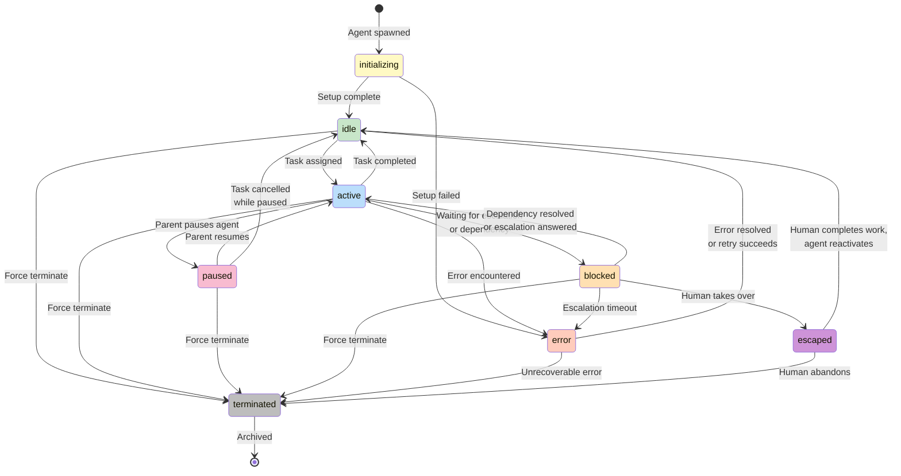

# Agent Lifecycle States

## Overview

Every agent in the Pink Beam ARM system has a **status** that tracks where it is in its operational lifecycle. There are **8 possible states**, and agents transition between them based on events like task assignment, errors, human intervention, or termination. The state machine prevents invalid transitions and ensures predictable behavior.

---

## State Machine Diagram

The diagram below shows all possible agent states and how they transition:



---

## Detailed State Descriptions

### 🚀 **initializing**
An agent has just been spawned and is being set up.

**What happens:**
- Loading tenant context and configuration
- Downloading model weights (if needed)
- Initializing memory and session state
- Setting up API connections

**Next states:** `idle` (success) or `error` (setup failed)

**Duration:** Typically 10-30 seconds

**Example:** After CEO spawns a Marketing Manager, it enters `initializing` while loading its model and configuration.

---

### ✅ **idle**
Agent is fully initialized, healthy, and **ready to receive work**.

**What happens:**
- Monitoring for incoming tasks
- Maintaining session and memory
- No active computation
- Can receive spawning requests (if role allows)

**Next states:** `active` (task assigned), `terminated` (force terminate)

**Example:** A Content Writer agent sitting between tasks, ready to write the next blog post.

**Why this state matters:** Lets you know the agent is operational and not consuming compute resources on background work.

---

### ⚙️ **active**
Agent is **currently working on a task**.

**What happens:**
- Processing the assigned task
- May call external APIs
- May spawn child agents to help
- Generating output or actions
- Actively using compute resources

**Next states:**
- `idle` (task completed successfully)
- `paused` (parent paused it)
- `blocked` (waiting for escalation or dependency)
- `error` (error encountered)
- `terminated` (force terminate)

**Example:** The Code Review Bot is actively reviewing a pull request.

**Why this state matters:** Tells you the agent is busy; don't assign new independent tasks yet (it can delegate or spawn helpers though).

---

### ⏸️ **paused**
Agent's parent has **temporarily suspended** its work.

**What happens:**
- All work halted
- Task context saved
- Memory frozen
- Minimal resources used
- Waiting for parent signal to resume

**Next states:**
- `active` (parent resumes)
- `idle` (task cancelled)
- `terminated` (force terminate)

**Example:** CEO pauses the Marketing Manager while waiting for budget approval; later resumes it.

**Why this state matters:** Parents can pause runaway agents or redirect resources without losing work context.

---

### 🚧 **blocked**
Agent is **waiting for external input** before it can continue.

**What happens:**
- Task is paused (but not cancelled)
- Waiting for escalation resolution
- Waiting for a dependency to complete
- Waiting for human response or approval
- May have a timeout (e.g., 24 hours)

**Next states:**
- `active` (escalation answered or dependency resolved)
- `escaped` (human takes over)
- `error` (escalation timeout/no response)
- `terminated` (force terminate)

**Example:** A Worker agent has a question that requires human judgment. It escalates and enters `blocked` until the human responds.

**Why this state matters:** Distinguishes "agent is thinking" (active) from "agent is waiting for external response" (blocked). Helps identify bottlenecks.

---

### ⚠️ **error**
Agent has **encountered an error** and needs attention.

**What happens:**
- Task execution failed
- Error logged with stack trace
- Agent stops processing
- Can retry or require manual intervention
- Parent is notified

**Next states:**
- `idle` (error resolved, retry succeeds)
- `terminated` (unrecoverable error)

**Example:** A Worker agent tries to call an external API but gets a 500 error. It enters `error` state.

**Why this state matters:** Prevents silent failures; gives parents visibility into problems and lets them decide whether to retry or escalate.

---

### 👤 **escaped**
**Human has taken direct control** and stepped in to do the work themselves.

**What happens:**
- Agent suspends work
- Human is doing the task directly
- Agent memory preserved (can resume later)
- Task is paused

**Next states:**
- `idle` (human finishes, agent reactivates)
- `terminated` (human abandons the task)

**Example:** An agent is stuck escalating a complex decision. The human says "I'll take it from here." Agent enters `escaped`.

**Why this state matters:** Allows graceful handoff to humans without destroying the agent. Can resume later or terminate if not needed.

---

### 💀 **terminated**
Agent has been **cleaned up and archived**. It will never run again.

**What happens:**
- All sessions closed
- Memory deallocated
- Task assigned to it is reassigned/cancelled
- Record kept for audit trail
- Removed from active agent roster

**Next states:** None — `[*]` (archive)

**Example:** A seasonal holiday campaign bot is terminated after the season ends.

**Why this state matters:** Clean cleanup; ensures no orphaned sessions or resources. Audit trail remains for compliance.

---

## State Transition Rules

| **From** | **To** | **Who triggers?** | **Condition** |
|:---|:---|:---|:---|
| initializing | idle | Runtime | Setup completes successfully |
| initializing | error | Runtime | Setup fails (network, model error, etc.) |
| idle | active | Task system | Task assigned to agent |
| idle | terminated | Parent / Admin | Force termination |
| active | idle | Task system | Task completed (success) |
| active | paused | Parent | Parent calls pause() |
| active | blocked | Agent | Agent calls escalate() |
| active | error | Runtime | Task fails with exception |
| active | terminated | Parent / Admin | Force termination |
| paused | active | Parent | Parent calls resume() |
| paused | idle | Task system | Task cancelled while paused |
| paused | terminated | Parent / Admin | Force termination |
| blocked | active | Escalation system | Escalation resolved |
| blocked | escaped | Human | Human takes over task |
| blocked | error | Timeout handler | Escalation timeout |
| blocked | terminated | Parent / Admin | Force termination |
| error | idle | Retry handler | Retry succeeds |
| error | terminated | Parent / Admin | Unrecoverable or force terminate |
| escaped | idle | Human | Human finishes task |
| escaped | terminated | Human | Human abandons task |

---

## State Transition Examples

### Example 1: Happy Path (Task Completed)
```
initializing → idle → active → idle
```
A new agent is spawned, set up, assigned a task, completes it, and returns to idle.

### Example 2: Escalation & Resolution
```
active → blocked → active → idle
```
Agent hits a decision it can't make alone, escalates to parent. Parent answers. Agent resumes and completes task.

### Example 3: Error Recovery
```
active → error → idle → active → idle
```
Agent fails on first attempt. Error is resolved (e.g., API back online). Parent retries. Task succeeds.

### Example 4: Human Intervention
```
active → blocked → escaped → idle
```
Agent is blocked waiting for escalation. Human decides to take over directly. Once human finishes, agent reactivates.

### Example 5: Termination
```
idle → active → error → terminated
```
Agent fails unrecoverably. Parent decides to terminate it rather than fix it. Agent is cleaned up and archived.

---

## Key Takeaways

✓ **Clear Visibility:** Every agent state tells you exactly what it's doing
✓ **Predictable Transitions:** Only valid state changes are allowed
✓ **Parent Control:** Parents can pause, resume, or terminate agents
✓ **Human Handoff:** `escaped` state allows graceful human takeover
✓ **Error Resilience:** `error` state doesn't crash the system; allows recovery
✓ **Audit Trail:** Status history is logged for compliance and debugging
✓ **Resource Awareness:** `idle` vs `active` tells you resource utilization
✓ **Dependency Handling:** `blocked` state explicitly represents waiting conditions

---

## Common Operational Patterns

**Pattern 1: Fire and Forget**
```
idle → active → idle → active → idle
```
Simple repetitive work; agent cycles between idle and active.

**Pattern 2: Escalation Chain**
```
active → blocked → active → active → ... → idle
```
Agent escalates, parent responds, agent resumes and may escalate again.

**Pattern 3: Pause and Resume**
```
active → paused → active → idle
```
Parent pauses work during maintenance, then resumes.

**Pattern 4: Resource Cleanup**
```
idle → active → error → terminated
```
Unrecoverable error; parent terminates and replaces agent.

---

## Related Documentation

- [[04-agent-hierarchy]] — Agent roles, spawning, and authorization
- [[09-escalation-workflow]] — How escalations work and when agents enter `blocked` state
- [[12-agent-protocol]] — Full AAP specification for agent lifecycle messages
- [[AGENT-PROTOCOL]] — Message types and state machine specification
