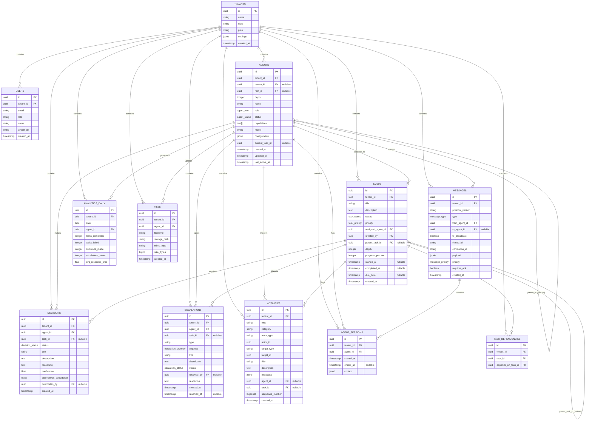

# Data Model

## Overview

ARM uses PostgreSQL via Supabase with 13+ core tables that form the backbone of the agent relationship management system. **Every table has a `tenant_id` field** to enforce multi-tenancy isolation at the database level using Row-Level Security (RLS) policies. This ensures complete data segregation between tenants while sharing a single database infrastructure.

The database is organized into several logical domains:
- **Organizational**: Tenants, Users, Agents
- **Execution**: Tasks, Task Dependencies
- **Intelligence**: Decisions, Escalations
- **Communication**: Messages, Agent Sessions
- **Observation**: Activities (audit trail)
- **Storage**: Files, Analytics

## Entity Relationship Diagram



## Core Tables Explained

### TENANTS
The root entity for multi-tenancy. Each tenant is completely isolated.
- `id`: Primary key (UUID)
- `name`: Human-readable tenant name (e.g., "Acme Corp AI Division")
- `slug`: URL-friendly identifier
- `plan`: Subscription tier (e.g., "starter", "professional", "enterprise")
- `settings`: JSONB column for tenant-specific configuration (feature flags, limits, preferences)
- `created_at`: Timestamp

### USERS
Human users within a tenant. Users authenticate via OTP (6-digit code).
- `id`: Primary key (UUID)
- `tenant_id`: Foreign key to TENANTS (determines which tenant this user belongs to)
- `email`: Unique per tenant, used for OTP login
- `role`: User role (e.g., "owner", "manager", "viewer") — controls what they can see/do
- `name`: Display name
- `avatar_url`: Profile picture URL
- `created_at`: Timestamp

### AGENTS
AI agents that perform work. Agents form a **hierarchical tree** where humans are roots and can spawn child agents.
- `id`: Primary key (UUID)
- `tenant_id`: Foreign key to TENANTS
- `parent_id`: Foreign key to AGENTS (nullable) — who spawned this agent, forms a tree
- `root_id`: Foreign key to AGENTS — points to the human root of this agent's subtree
- `depth`: Hierarchy depth (0 = human/root, 1+ = spawned agents)
- `name`: Agent name (e.g., "Research Specialist Alpha")
- `role`: Agent role enum (`ceo`, `manager`, `worker`, `specialist`, `system`) — determines capabilities
- `status`: Agent state enum (`initializing`, `idle`, `active`, `paused`, `blocked`, `error`, `escaped`, `terminated`)
- `capabilities`: Text array of what this agent can do (e.g., `['spawn', 'delegate', 'decide', 'escalate']`)
- `model`: LLM model identifier (e.g., `"gpt-4-turbo"`, `"claude-3-sonnet"`)
- `configuration`: JSONB with model-specific settings (temperature, max_tokens, system prompt, etc.)
- `current_task_id`: Foreign key to TASKS (what agent is working on now, nullable if idle)
- `created_at`, `updated_at`, `last_active_at`: Timestamps

### TASKS
Units of work assigned to agents. Tasks can be hierarchical (parent/child) and have dependencies.
- `id`: Primary key (UUID)
- `tenant_id`: Foreign key to TENANTS
- `title`: Short task name (e.g., "Analyze Q4 sales data")
- `description`: Full task description and acceptance criteria
- `status`: Task status enum (`queued`, `in_progress`, `blocked`, `review`, `completed`, `failed`, `cancelled`)
- `priority`: Priority enum (`low`, `normal`, `high`, `urgent`) — affects scheduling
- `assigned_agent_id`: Foreign key to AGENTS — which agent owns this task
- `created_by`: UUID of user/agent that created this task
- `parent_task_id`: Foreign key to TASKS (nullable) — creates task hierarchy
- `depth`: How deep in the task tree (0 = root task)
- `progress_percent`: 0-100, manually or automatically updated
- `started_at`, `completed_at`: Timestamps marking work lifecycle
- `due_date`: Target completion time (nullable)
- `created_at`: Timestamp

### TASK_DEPENDENCIES
Models task DAG (Directed Acyclic Graph). Task B depends on Task A means A must complete before B starts.
- `id`: Primary key (UUID)
- `tenant_id`: Foreign key to TENANTS
- `task_id`: Foreign key to TASKS — the task that is blocked
- `depends_on_task_id`: Foreign key to TASKS — the task that must complete first
- Creates a directed edge in the task graph for dependency resolution

### DECISIONS
Records when agents make choices. Critical for audit trail and escalation tracking.
- `id`: Primary key (UUID)
- `tenant_id`: Foreign key to TENANTS
- `agent_id`: Foreign key to AGENTS — the agent making the decision
- `task_id`: Foreign key to TASKS (nullable) — related task, if any
- `status`: Decision status enum (`proposed`, `approved`, `rejected`, `overridden`, `executed`)
- `title`: Decision summary (e.g., "Allocate budget to marketing campaign")
- `description`: Full rationale and context
- `reasoning`: Why agent chose this option
- `confidence`: Float 0.0-1.0, determines if escalation needed
- `alternatives_considered`: Text array of other options explored
- `overridden_by`: UUID of who overrode this decision (nullable)
- `created_at`: Timestamp

### ESCALATIONS
When agents can't decide alone or detect problems, they escalate to a human/parent agent.
- `id`: Primary key (UUID)
- `tenant_id`: Foreign key to TENANTS
- `agent_id`: Foreign key to AGENTS — who raised the escalation
- `task_id`: Foreign key to TASKS (nullable) — related task
- `type`: Escalation type (e.g., "low_confidence_decision", "resource_unavailable", "ethical_concern")
- `urgency`: Urgency enum (`low`, `normal`, `high`, `critical`)
- `title`, `description`: What went wrong or needs human judgment
- `status`: Open or resolved
- `resolved_by`: UUID of who resolved it (nullable)
- `resolution`: How it was resolved (nullable)
- `created_at`, `resolved_at`: Timestamps

### ACTIVITIES
Complete audit trail of every state change. Triggered by database events.
- `id`: Primary key (UUID)
- `tenant_id`: Foreign key to TENANTS
- `type`: Activity type (e.g., "agent_spawned", "task_completed", "decision_made", "escalation_raised")
- `category`: Grouping category (e.g., "agent", "task", "decision")
- `actor_type`: Who did it? ("user", "agent", "system")
- `actor_id`: UUID of the actor
- `target_type`: What changed? ("agent", "task", "decision", "escalation")
- `target_id`: UUID of target entity
- `title`: Human-readable summary
- `description`: Additional context
- `metadata`: JSONB for structured event data
- `agent_id`, `task_id`: Foreign keys for filtering
- `sequence_number`: BIGSERIAL for ordering within tenant (prevents out-of-order delivery)
- `created_at`: Timestamp

### MESSAGES
Inter-agent communication. Agents send messages to coordinate work or request decisions.
- `id`: Primary key (UUID)
- `tenant_id`: Foreign key to TENANTS
- `protocol_version`: Version of message protocol in use (e.g., "1.0")
- `type`: Message type enum (e.g., "task_delegation", "decision_request", "status_update", "ack")
- `from_agent_id`: Foreign key to AGENTS — sender
- `to_agent_id`: Foreign key to AGENTS (nullable) — recipient, if unicast
- `to_broadcast`: Boolean — if true, message goes to all agents in scope
- `thread_id`: Groups related messages (conversation ID)
- `correlation_id`: Links request/response pairs
- `payload`: JSONB message body and metadata
- `priority`: Priority enum for queuing
- `requires_ack`: Boolean — does sender want acknowledgment?
- `created_at`: Timestamp

### AGENT_SESSIONS
Tracks agent execution contexts and session history.
- `id`: Primary key (UUID)
- `tenant_id`: Foreign key to TENANTS
- `agent_id`: Foreign key to AGENTS
- `started_at`: When session began
- `ended_at`: When session ended (nullable if ongoing)
- `context`: JSONB containing session state (variables, memory, execution context)

### ANALYTICS_DAILY
Aggregated metrics rolled up daily for dashboard and reporting.
- `id`: Primary key (UUID)
- `tenant_id`: Foreign key to TENANTS
- `date`: Date of aggregation
- `agent_id`: Foreign key to AGENTS (nullable for tenant-level aggregate)
- `tasks_completed`: Count of completed tasks
- `tasks_failed`: Count of failed tasks
- `decisions_made`: Count of decisions executed
- `escalations_raised`: Count of escalations triggered
- `avg_response_time`: Average time to respond to requests (seconds)

### FILES
Storage metadata for files uploaded by agents or users.
- `id`: Primary key (UUID)
- `tenant_id`: Foreign key to TENANTS
- `agent_id`: Foreign key to AGENTS (nullable)
- `filename`: Original filename
- `storage_path`: Path in Supabase Storage bucket
- `mime_type`: Content type (e.g., "application/pdf")
- `size_bytes`: File size in bytes
- `created_at`: Timestamp

## Key Enums

### agent_role
- `ceo`: Top-level decision maker, can spawn any agent, full authority
- `manager`: Can spawn workers, delegate tasks, make decisions within scope
- `worker`: Can complete tasks, propose decisions
- `specialist`: Domain expert, can escalate and provide recommendations
- `system`: System agent for automated processes

### agent_status
- `initializing`: Being set up
- `idle`: Ready, waiting for work
- `active`: Currently executing
- `paused`: Temporarily halted
- `blocked`: Waiting on external resource or decision
- `error`: Encountered an error
- `escaped`: Exceeded authority boundaries or safety guardrails
- `terminated`: Shut down permanently

### task_status
- `queued`: Created, waiting to be claimed
- `in_progress`: Agent is working on it
- `blocked`: Waiting on dependency or escalation
- `review`: Completed, needs approval
- `completed`: Done and approved
- `failed`: Could not be completed
- `cancelled`: No longer needed

### task_priority
- `low`: Can wait, low urgency
- `normal`: Standard priority
- `high`: Important, should be prioritized
- `urgent`: Must be done ASAP

### decision_status
- `proposed`: Agent proposes, awaiting approval
- `approved`: Parent/human approved
- `rejected`: Parent/human rejected
- `overridden`: Parent/human changed it
- `executed`: Action taken

### escalation_urgency
- `low`: Can be handled asynchronously
- `normal`: Should be reviewed soon
- `high`: Needs prompt attention
- `critical`: Immediate human intervention required

## Stored Functions

These PostgreSQL stored procedures power common patterns:

### `get_agent_descendants(agent_id UUID)`
Returns all descendants of an agent (the entire subtree). Used for permission checks and cascading operations.

### `get_task_chain(task_id UUID)`
Follows parent_task_id chain to return the full task hierarchy from root to the given task.

### `rollup_daily_analytics()`
Aggregates activity metrics for the previous day into ANALYTICS_DAILY. Runs nightly via a scheduled job.

### `calculate_escalation_sla(escalation_id UUID)`
Calculates time-to-resolve SLA and urgency adjustments based on escalation age and type.

### `set_tenant_context(tenant_id UUID)`
Sets `app.current_tenant` in the session, enabling RLS policies to filter rows by tenant.

## Multi-Tenancy & RLS

Every table has an RLS policy attached. For example, on AGENTS:

```sql
CREATE POLICY agents_tenant_isolation
  ON agents
  FOR ALL
  USING (tenant_id = current_setting('app.current_tenant')::uuid);
```

When an API request comes in, the code calls `set_tenant_context(tenant_id)` and all subsequent queries only see rows for that tenant. This is enforced at the database level, not application logic.

**Server-side (Edge Functions & API routes)**: Use the Supabase service role client, which bypasses RLS, then manually filter by tenant_id.

**Client-side (Browser)**: Use the anon key with RLS enabled. Client queries are automatically filtered by the current tenant.

## Related Documentation

- [[03-multi-tenancy]] — How tenant isolation works
- [[07-task-pipeline]] — Task status flow and dependencies
- [[09-escalation-workflow]] — Escalation types and SLA calculations
- [[04-agent-hierarchy]] — Agent role hierarchy and capabilities
- [[ARCHITECTURE]] — System-wide architecture and design patterns
