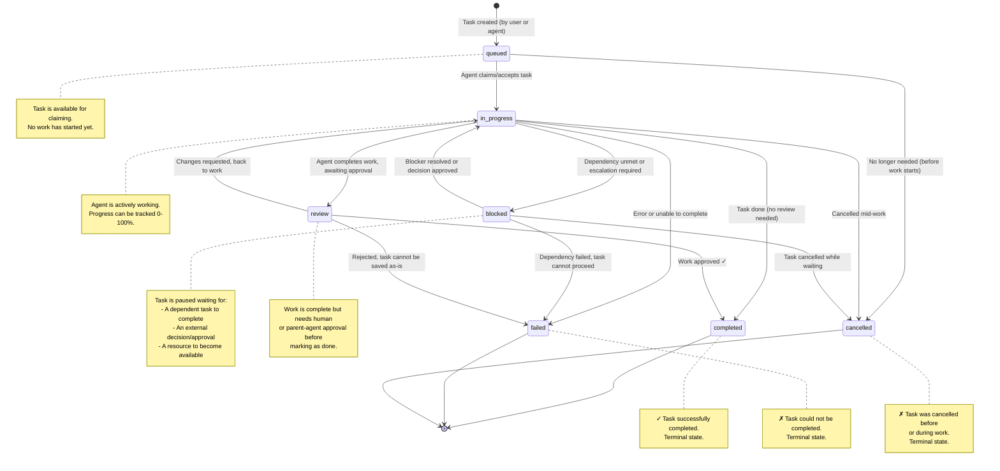
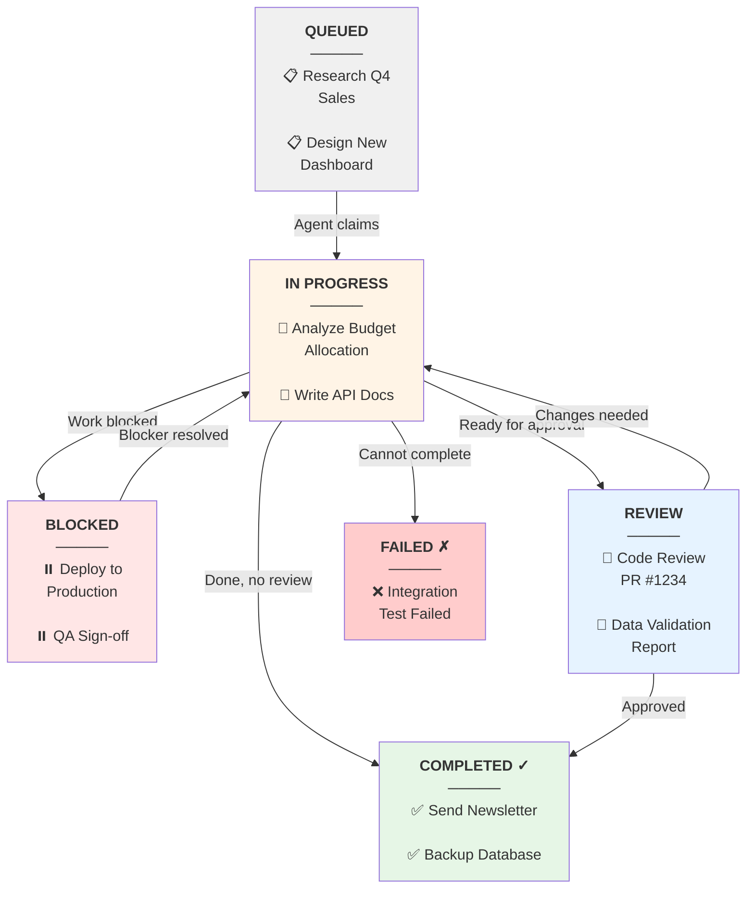
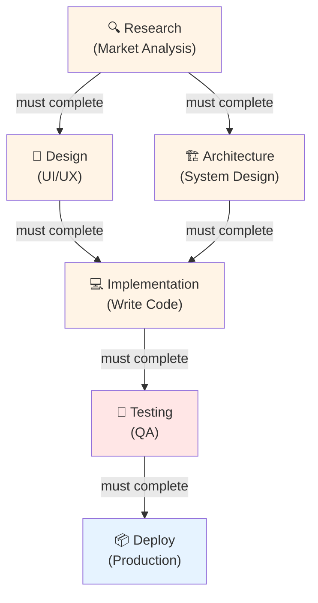
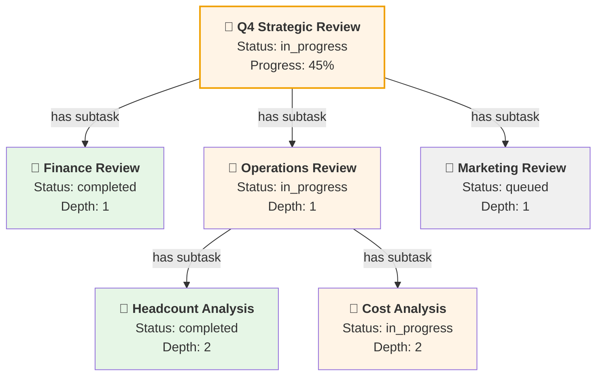
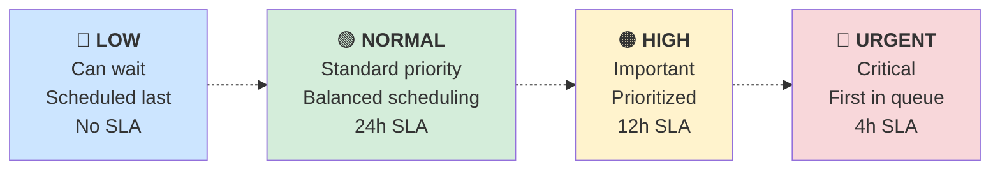
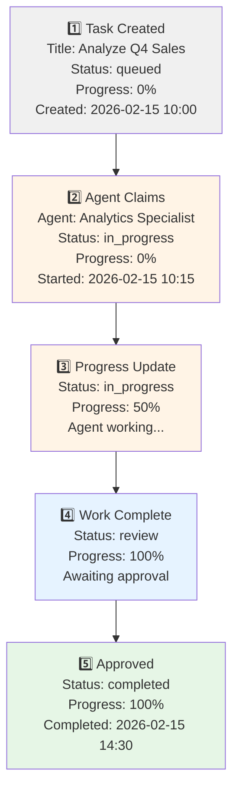

# Task Pipeline & Kanban

## Overview

Tasks in ARM flow through a **7-stage Kanban pipeline** representing the lifecycle of work. Each stage is a status that communicates what phase a task is in. Tasks can also be **hierarchical** (subtasks under parent tasks) and **have dependencies** (one task must complete before another can start), forming a Directed Acyclic Graph (DAG).

This document explains:
1. **Task Status Transitions**: How tasks move between stages
2. **Kanban Board Layout**: The visual columns and flow
3. **Task Dependencies**: DAG structure for complex workflows
4. **Priority System**: How urgency affects ordering
5. **Key Task Fields**: What metadata is tracked

## Task Status State Machine

Tasks transition through these 7 statuses:

## Kanban Board Layout

A typical ARM dashboard shows tasks across **5 visible columns**:

**Column Meanings:**
- **QUEUED**: New tasks waiting for an agent to claim them
- **IN PROGRESS**: Agent is actively working; progress is tracked
- **BLOCKED**: Task paused due to dependencies, decisions, or external factors
- **REVIEW**: Work complete, awaiting human/parent-agent approval
- **COMPLETED**: ✓ Done (terminal)
- **FAILED**: ✗ Could not complete (terminal)
- *Note: CANCELLED tasks are typically filtered out of the main board*

## Task Dependencies (DAG)

Complex workflows involve **task dependencies**. Task B cannot start until Task A completes. The `TASK_DEPENDENCIES` table creates directed edges.

### Example: Software Release Workflow

**Key Points:**
- **Task A** (Research) must complete before **B** or **C** can start (parallel branches)
- **Task B** (Design) AND **C** (Architecture) must both complete before **D** (Implementation)
- This is a **DAG (Directed Acyclic Graph)** — no cycles allowed
- If a dependency fails, dependent tasks move to **blocked** status
- System automatically enforces: cannot move task to `in_progress` if dependencies are not `completed`

## Task Hierarchy (Parent/Child)

Tasks can also be **hierarchical**. A parent task is broken into subtasks:

**Hierarchy Fields:**
- `parent_task_id`: Points to parent (NULL if root task)
- `depth`: 0 = root, 1 = child, 2 = grandchild, etc.
- Parent task progress is often the average of child task progress
- Subtasks inherit some settings from parent (tenant_id, some priority logic)

## Priority System

Tasks have 4 priority levels that affect **scheduling and ordering**:

**Priority Effects:**
- **LOW**: Nice-to-have work, scheduled when agents are free
- **NORMAL**: Regular work, standard SLA window
- **HIGH**: Important but not emergency, prioritized when possible
- **URGENT**: Drop everything else, immediate attention needed

When an agent queries for "next task to do", higher-priority tasks are returned first.

## Key Task Fields Explained

| Field | Type | Purpose |
|-------|------|---------|
| `id` | UUID | Unique identifier |
| `tenant_id` | UUID (FK) | Multi-tenancy isolation |
| `title` | String | Short task name (50-200 chars) |
| `description` | Text | Full details, acceptance criteria, instructions |
| `status` | Enum | Current stage (queued, in_progress, blocked, review, completed, failed, cancelled) |
| `priority` | Enum | Urgency level (low, normal, high, urgent) |
| `assigned_agent_id` | UUID (FK) | Which agent owns this task |
| `created_by` | UUID | User or agent that created it |
| `parent_task_id` | UUID (FK) | Parent task (nullable if root) |
| `depth` | Integer | Hierarchy depth (0 = root) |
| `progress_percent` | Integer | 0-100, manually or auto-updated |
| `started_at` | Timestamp | When agent started work |
| `completed_at` | Timestamp | When work finished |
| `due_date` | Timestamp | Target completion (nullable) |
| `created_at` | Timestamp | When task was created |

## Task Lifecycle Example

Here's a concrete example of a task moving through the pipeline:

## Integration with Other Systems

### Blocked Tasks & Dependencies
When a task's dependency fails:
1. Dependent task status → `blocked`
2. Activity logged to audit trail
3. Assigned agent notified (via notification system)
4. Can be resumed once dependency is retried and completed

### Blocked Tasks & Escalations
When task requires a decision to proceed:
1. Agent escalates (raises escalation record)
2. Task status → `blocked`
3. Human/parent-agent reviews escalation
4. Decision made and approved
5. Agent resumes task, status → `in_progress`

### Blocked Tasks & External Factors
Tasks can be blocked by external events:
- Waiting for customer input
- Waiting for API service to come online
- Waiting for resource (e.g., GPU availability)
- Manual approval from system administrator

See [[09-escalation-workflow]] for how escalations interact with task blocking.

## Dashboard & Reporting

The Activity Feed ([[16-activity-feed]]) displays all task transitions, creating a complete audit trail:
- Task created by User A
- Agent B claimed task
- Agent B updated progress to 50%
- Agent B requested review
- User A approved
- Task marked completed

Metrics dashboard queries ANALYTICS_DAILY for:
- Tasks completed per day/week/month
- Average time-to-completion by priority
- Failure rate by agent or task type
- Blocked time analysis

## Related Documentation

- [[04-agent-hierarchy]] — How agents are assigned to tasks
- [[06-data-model]] — Task table schema and task_dependencies
- [[08-decision-flow]] — How decisions interact with task blocking
- [[09-escalation-workflow]] — Escalations that cause blocking
- [[16-activity-feed]] — Complete task event audit trail
