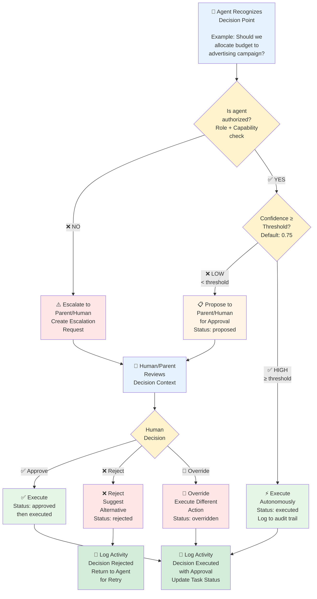
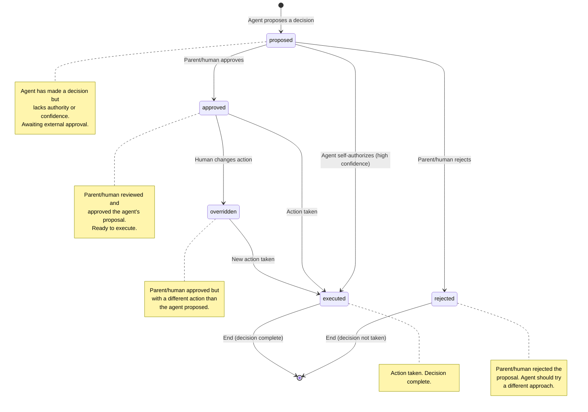
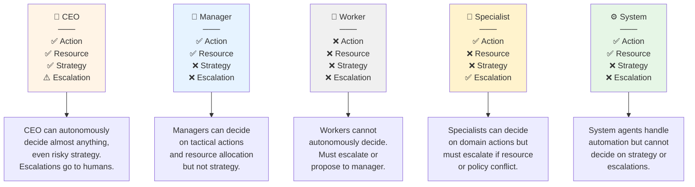
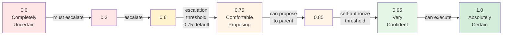
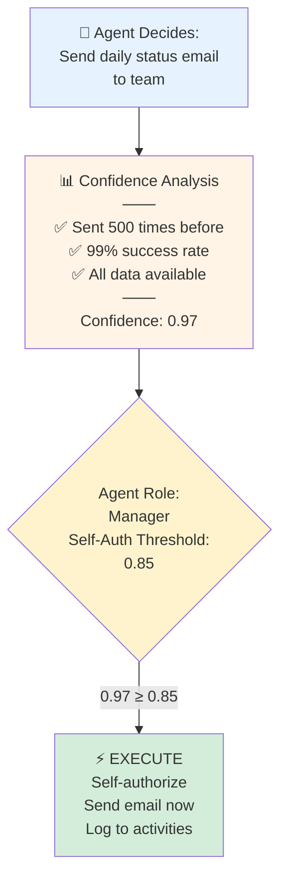
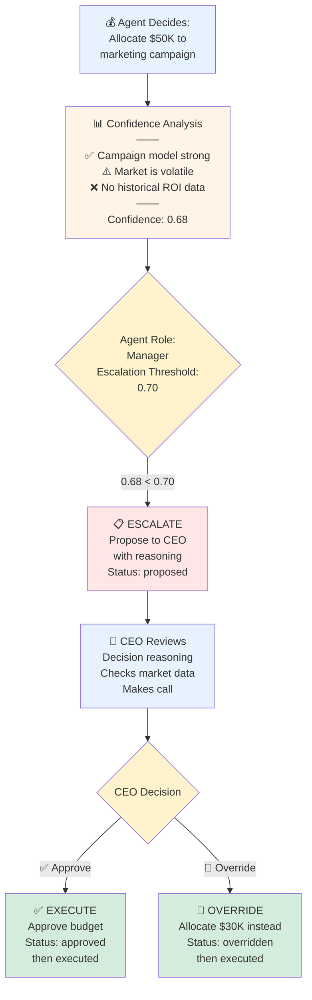
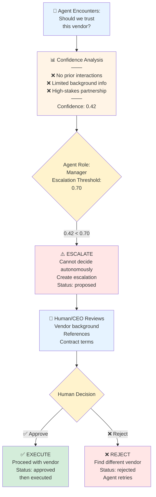
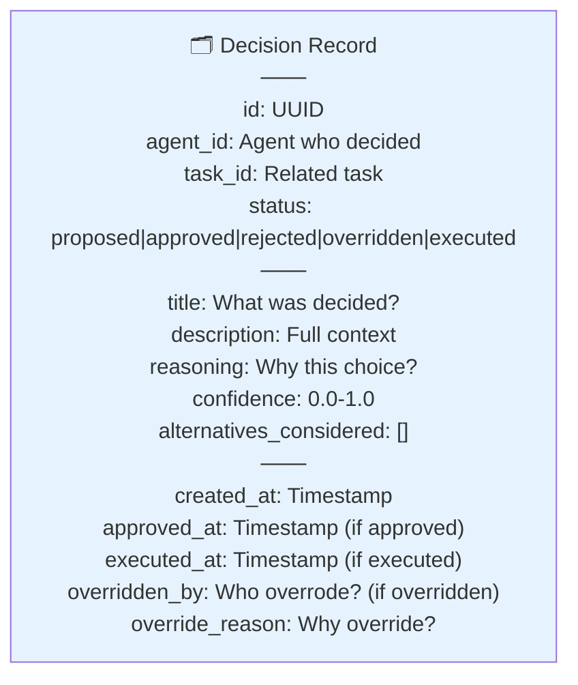
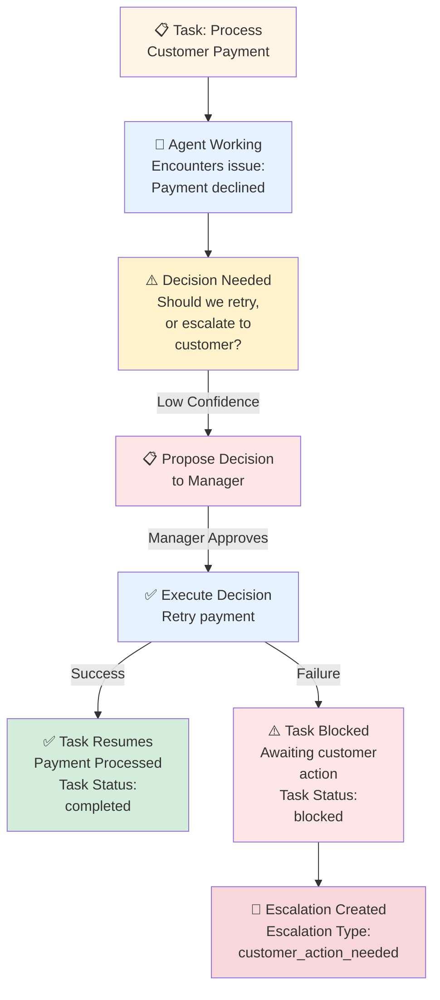

# Decision Flow

## Overview

When ARM agents encounter situations requiring judgment calls, they follow a **decision framework** that balances autonomy with oversight. An agent can self-authorize low-risk decisions (high confidence) but must escalate uncertain decisions to a human or parent agent.

This document explains:
1. **Decision Lifecycle**: From recognition to execution
2. **Authority Matrix**: Who can decide what (role × scope)
3. **Confidence Scoring**: How certainty determines escalation
4. **Decision Categories**: Types of decisions and their implications
5. **Approval Chain**: Multi-level review process

## Decision Lifecycle Flowchart

When an agent encounters a decision point, this is what happens:



## Decision Status State Machine

Decisions transition through these 5 statuses:



## Authority Matrix

An agent's ability to **self-authorize** a decision depends on:
1. **Agent Role** (ceo, manager, worker, specialist, system)
2. **Decision Category** (action, resource, escalation, strategy)
3. **Confidence Score** (0.0 to 1.0)
4. **Agent Capabilities** (must have 'decide' capability)

### Role-Based Authority



**Key Rules:**
- **CEO** has full authority within the tenant (unless decision violates system policy)
- **Manager** can decide on tactical matters but strategy requires CEO approval
- **Worker** has no autonomous decision authority; must defer to manager
- **Specialist** has domain expertise and can decide within their specialty
- **System** agents handle scheduled tasks and automation, no judgment calls

### Decision Category Authority Table

| Category | Description | CEO | Manager | Worker | Specialist | System |
|----------|-------------|-----|---------|--------|------------|--------|
| **action** | Execute business logic (send email, create resource, etc.) | ✅ | ✅ | ❌ | ✅ | ✅ |
| **resource** | Allocate compute, budget, or infrastructure | ✅ | ✅ | ❌ | ❌ | ✅ |
| **strategy** | Long-term direction, organizational policy | ✅ | ❌ | ❌ | ❌ | ❌ |
| **escalation** | Raise issue to human/parent for judgment | ✅ | ❌ | ✅ | ✅ | ❌ |

## Confidence Scoring

**Confidence** ranges from 0.0 (completely uncertain) to 1.0 (absolutely certain).



### Confidence Thresholds

**Default Configuration (per agent):**
- **Escalation Threshold**: 0.75
  - If confidence < 0.75, agent MUST propose to parent (cannot self-authorize)
  - If confidence ≥ 0.75, agent can propose OR self-authorize depending on role

- **Self-Authorization Threshold**: 0.85
  - If confidence ≥ 0.85 AND agent has 'decide' capability AND role allows it, agent CAN self-authorize
  - If confidence < 0.85, agent MUST propose to parent for approval

### How Confidence is Calculated

Confidence is subjective but informed by:
- **Past success rate**: Agent's historical decision accuracy
- **Domain similarity**: How similar is this to past decisions?
- **Information completeness**: Do we have all needed data?
- **Time pressure**: More time to deliberate = higher confidence
- **Model certainty**: LLM's own output logits/probabilities
- **Stakeholder agreement**: Do other agents agree?

Examples:
- Sending a scheduled status email: 0.95 confidence (routine, low risk)
- Allocating $5,000 budget to a marketing campaign: 0.60 confidence (uncertain ROI)
- Recommending a specialist to review code: 0.85 confidence (domain knowledge)
- Deciding to terminate an agent: 0.40 confidence (irreversible, needs human)

## Confidence & Role Interaction

An agent's **role modifies** confidence thresholds:

| Role | Escalation Threshold | Self-Auth Threshold | Notes |
|------|----------------------|-------------------|-------|
| CEO | 0.50 | 0.70 | High authority, lower confidence needed |
| Manager | 0.70 | 0.85 | Moderate authority, higher confidence needed |
| Worker | 1.00 | N/A | Cannot self-authorize, must escalate everything |
| Specialist | 0.65 | 0.80 | Domain expert, lower threshold in specialty |
| System | 0.90 | N/A | Automation only, no judgment calls |

## Decision Categories Explained

### 1. Action
**What**: Execute a business process (send email, create record, call API)
**Example**: "Send welcome email to new customer"
**Authority**: Most roles can decide on actions within scope
**Reversibility**: May be reversible (can unsend, can delete), medium risk

### 2. Resource
**What**: Allocate budget, compute, storage, or infrastructure
**Example**: "Spin up new GPU instance for training"
**Authority**: CEO, Manager, System only
**Reversibility**: Usually reversible (delete resource, refund budget), high cost

### 3. Escalation
**What**: Raise an issue to human/parent that agent cannot resolve
**Example**: "Customer is angry, need human support"
**Authority**: Workers and Specialists can escalate; CEO/Manager receive escalations
**Reversibility**: Not reversible, affects human attention

### 4. Strategy
**What**: Set long-term direction, change policy, organizational restructure
**Example**: "Shut down this business unit"
**Authority**: CEO only
**Reversibility**: Not reversible, affects whole tenant

## Confidence in Action: Real Examples

### Example 1: Routine Email (High Confidence)



### Example 2: Budget Decision (Medium Confidence)



### Example 3: Uncertain Decision (Low Confidence)



## Decision Record Schema

Every decision is recorded with this metadata:



## Audit Trail & Accountability

Every decision is logged and immutable:
1. **Proposed**: Agent submits decision with reasoning and confidence
2. **Reviewed**: Human/parent reads and examines context
3. **Approved/Rejected/Overridden**: Decision recorded with who made final call
4. **Executed**: Action taken, logged to activities
5. **Queryable**: Full decision history available for compliance/debugging

Example audit log for a decision:
```
Decision #d7f2e1c9:
  "Should we retry failed API call?"

  Proposed by: ConnectionRetryAgent (Worker role)
  Proposed at: 2026-02-15 14:23:10
  Confidence: 0.72
  Reasoning: "Service is 95% recovered, retry has 80% success rate"
  Alternatives: "Wait 5 min", "Manual fix", "Skip request"

  Reviewed by: APIManager (Manager role)
  Reviewed at: 2026-02-15 14:23:45
  Decision: APPROVED

  Executed by: APIManager
  Executed at: 2026-02-15 14:24:00
  Result: SUCCESS (request succeeded on retry)
```

## Integration with Tasks & Escalations

Decisions often arise **during task execution**:



## Related Documentation

- [[04-agent-hierarchy]] — Agent roles and capabilities
- [[07-task-pipeline]] — How decisions interact with task status
- [[09-escalation-workflow]] — Escalations triggered by low-confidence decisions
- [[12-agent-protocol]] — AAP message types for decision communication
- [[16-activity-feed]] — Decision events logged to activities
