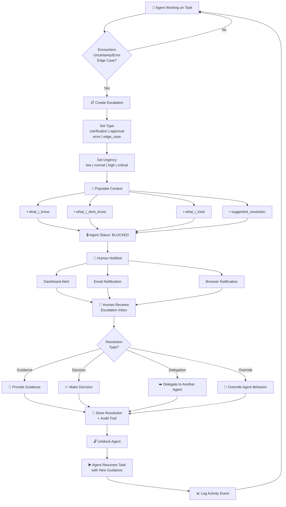
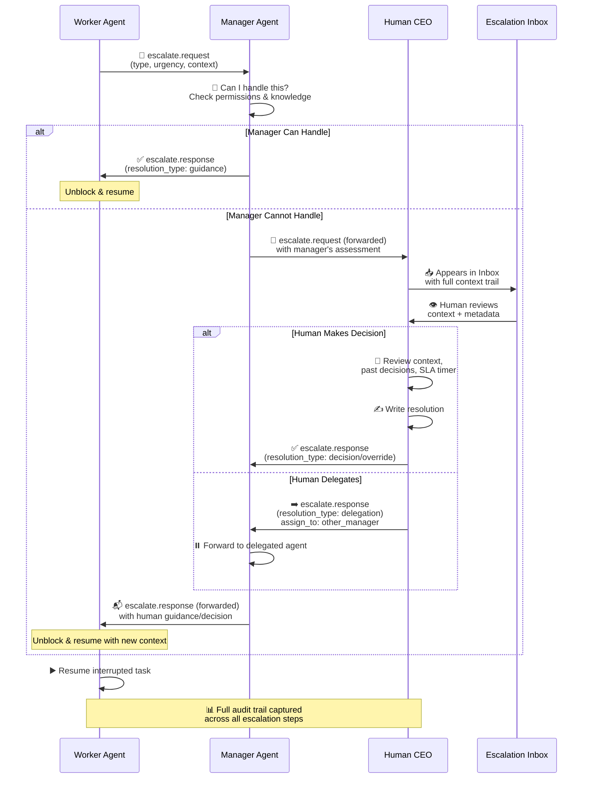
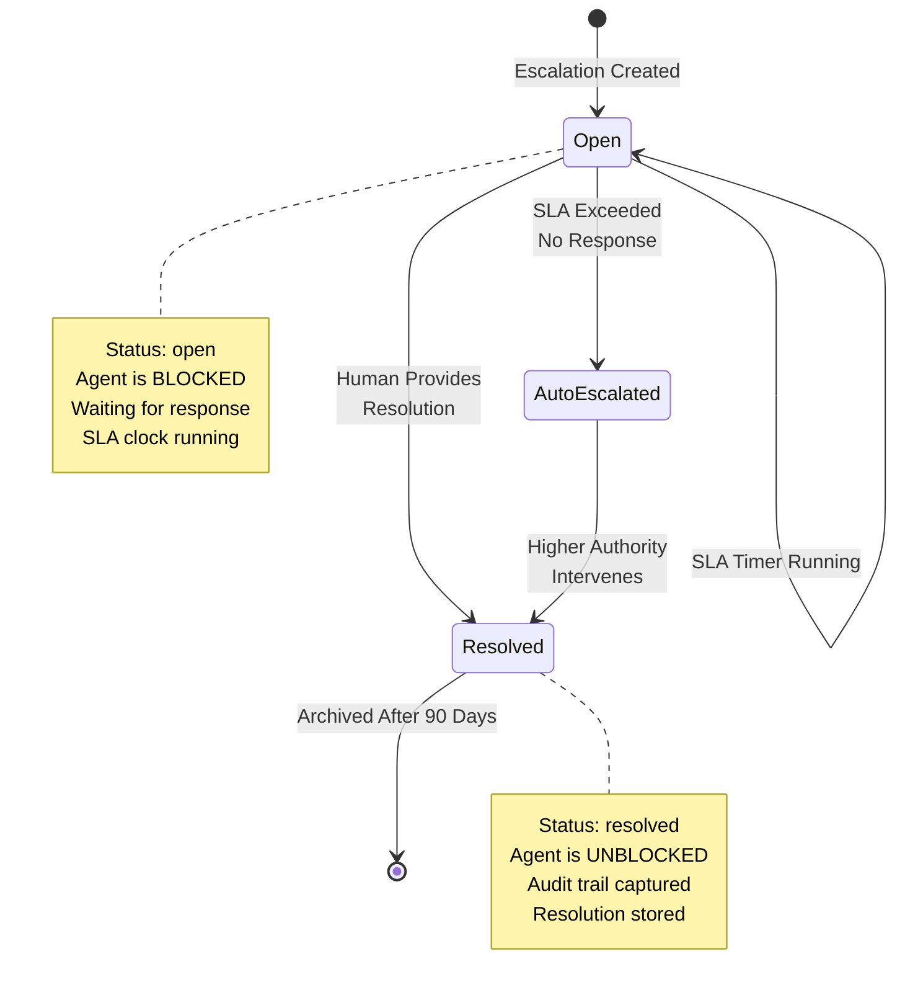

¬
# Escalation Workflow

## Overview

When an agent encounters a situation it can't handle alone, it creates an **escalation** — a request for human input or higher-level decision-making. Escalations are the **human-in-the-loop mechanism** that bridges the gap between autonomous agent work and human judgment.

Think of it like this: A worker bee discovers a threat to the hive that's outside its instructions. It can't handle it alone, so it alerts the manager bee. The manager assesses and either handles it directly or escalates to the queen (human CEO). The decision flows back down, and the worker resumes work with new guidance.

---

## Escalation Lifecycle



---

## Escalation Types

When should an agent escalate? Here are the four escalation types:

| Type | When Used | Example | Auto-Escalate if Unresolved |
|------|-----------|---------|--------------------------|
| **clarification** | Agent needs more information to proceed | "Should I target the US or EU market first?" | After missing 2 deadline reminders |
| **approval** | Agent needs permission for an important action | "Approve $5,000 ad spend for campaign X?" | After 1 reminder |
| **error** | Something unexpected went wrong | "API rate limit hit. Should I retry with exponential backoff?" | After 3 failed retry attempts |
| **edge_case** | Unusual or boundary situation | "Client requested contract terms outside our SLA" | After 1 escalation level |

---

## Urgency Levels & SLA Windows

Escalations are assigned urgencies that determine how quickly humans must respond. The system tracks SLA compliance automatically:

| Urgency | SLA Window | Auto-Escalate After | Typical Scenarios |
|---------|------------|-------------------|------------------|
| **low** | 24 hours | 48 hours | Minor clarifications, low-impact decisions |
| **normal** | 4 hours | 8 hours | Standard approvals, routine errors |
| **high** | 1 hour | 2 hours | Time-sensitive decisions, paying customer issues |
| **critical** | 15 minutes | 30 minutes | System outages, critical security issues, major revenue at risk |

---

## Full Escalation Flow (Sequence Diagram)

This diagram shows how escalations move through the agent hierarchy:



---

## Escalation Data Model

Each escalation is stored with these fields:

```
escalations table:
├─ id: UUID (primary key)
├─ tenant_id: UUID (multi-tenant isolation)
├─ agent_id: UUID (which agent created this escalation)
├─ task_id: UUID (what task triggered this escalation)
├─ type: enum (clarification | approval | error | edge_case)
├─ urgency: enum (low | normal | high | critical)
├─ title: text (short summary)
├─ description: text (full context)
├─ context: JSONB (what_i_know, what_i_dont_know, what_i_tried, suggested_resolution)
├─ agent_recommendation: text (agent's suggested solution)
├─ status: enum (open | resolved)
├─ resolved_by: UUID (human_id or manager_agent_id)
├─ resolution_type: enum (guidance | decision | delegation | override)
├─ resolution: text (the actual guidance/decision/delegation)
├─ resolution_notes: JSONB (metadata about the resolution)
├─ sla_urgency_computed: interval (SLA window for this urgency level)
├─ created_at: timestamp
├─ resolved_at: timestamp
├─ activity_logged: boolean (tracked in activities table)
└─ metadata: JSONB (free-form context)
```

---

## Escalation State Machine

Not all state transitions are allowed. Here's the valid state machine:



---

## Example Escalation: Approval Request

Here's a concrete example of an approval escalation:

**Agent:** Marketing Worker (spawned by Marketing Manager)
**Task:** Launch email campaign to 10K subscribers
**Trigger:** Campaign requires spend > $1,000, policy needs approval

**Escalation Created:**
- **Type:** approval
- **Urgency:** normal (1-day campaign, non-critical)
- **Title:** "Approve email campaign spend ($1,500)"
- **Description:** "Ready to launch email campaign to 10K subscribers. Spend: $1,500. Recipient list: premium_customers + engaged_users. Subject line A/B tested."
- **Context:**
  - **what_i_know:** Campaign targeting rules finalized, email templates ready, audience size confirmed, estimated ROI: 3.2x
  - **what_i_dont_know:** Final approval threshold (is $1,500 within budget?), any compliance flags?
  - **what_i_tried:** Pre-checked with budget API, confirmed all recipients opted in
  - **suggested_resolution:** Approve and proceed, or request modifications to targeting

**Agent Status:** BLOCKED (waits for approval)

**Human Reviews in Dashboard:**
- Sees escalation in inbox, priority: normal (4-hour SLA)
- Reviews campaign preview, targeting, spend
- Clicks "Approve" button
- Resolution stored with timestamp

**Agent Unblocked:**
- Marketing Worker receives: `escalate.response(resolution_type: decision, decision: approve)`
- Resumes task: launches campaign
- Updates task status to `in_progress`
- Activity logged automatically

---

## Best Practices for Escalations

### For Agents
- ✅ Escalate early if uncertain (better to ask than fail silently)
- ✅ Provide rich context (what_i_know, what_i_tried, suggested_resolution)
- ✅ Set appropriate urgency (don't cry wolf with "critical" for non-critical items)
- ❌ Don't escalate for routine decisions (those should be in agent config)
- ❌ Don't escalate without offering a suggested resolution

### For Humans
- ✅ Respond promptly (SLA timers are strict for reason)
- ✅ Provide clear guidance or decisions (ambiguous responses cause re-escalations)
- ✅ Update agent configuration to prevent future escalations of same type
- ✅ Review escalation patterns weekly (high escalation rate = bad config)
- ❌ Don't manually override agent behavior without documenting why
- ❌ Don't ignore critical escalations (auto-escalation will trigger)

---

## Related Documentation

- [[04-agent-hierarchy]] — How agents form a tree and inherit capabilities
- [[08-decision-flow]] — How agents make autonomous decisions
- [[10-event-system]] — How escalations trigger activity events
- [[ARCHITECTURE]] — Overall system design

---

## See Also

- `supabase/migrations/016-escalations-table.sql` — Schema definition
- `src/lib/supabase.ts` — Escalation queries
- `src/components/escalations/EscalationInbox.tsx` — Dashboard component
- `src/lib/emails/escalation-alert.tsx` — Email template
