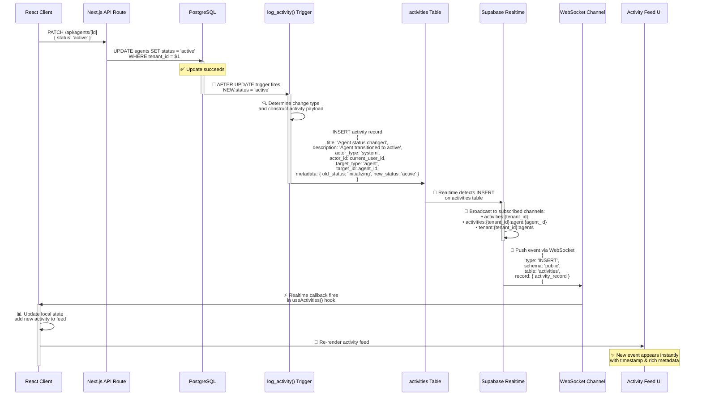
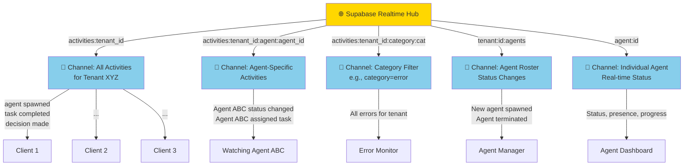
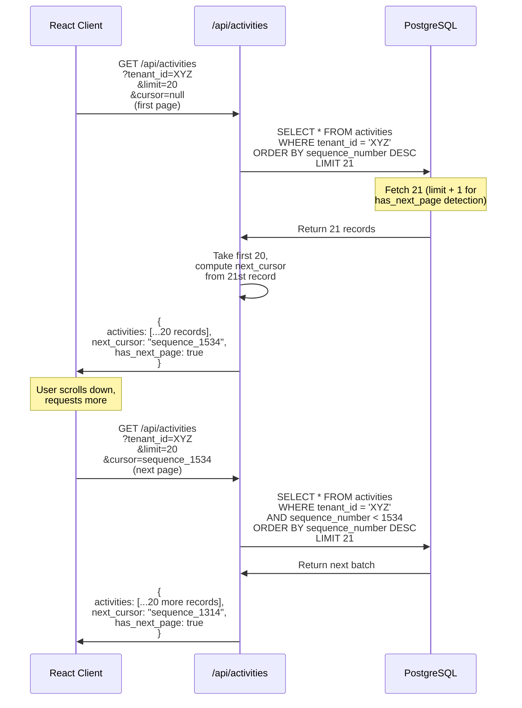
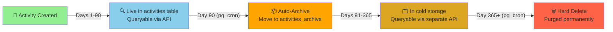

# Event-Driven System

## Overview

ARM is **event-driven architecture**. Every state change on agents, tasks, decisions, and escalations automatically fires a PostgreSQL trigger that logs an activity record. Supabase Realtime then pushes these events to connected clients via WebSocket in real-time.

Think of it like a concert venue: Every action backstage (agent working, task completing) triggers an entry in the event log. A live event feed broadcasts these changes to all audience members watching via their phones. No polling required—changes appear instantly.

---

## Complete Event Flow (Sequence Diagram)

Here's how a single change ripples through the entire system:



---

## Realtime Channel Architecture

Supabase Realtime uses a pub/sub channel system. Clients subscribe to channels of interest; only relevant events are pushed:



**Why multiple channels?**
- Reduces data noise (no need to hear about Agent 1 when watching Agent 2)
- Improves scalability (fewer messages = lower bandwidth)
- Enables selective subscriptions in UI components
- Allows filtering (only show "error" category events)

---

## Events That Trigger Activities

Not every database action creates an activity. Only meaningful state changes do:

| Entity | Events Tracked |
|--------|----------------|
| **Agents** | spawned, initialized, status_changed (idle→active→paused→blocked→error→terminated), config_updated, escalated |
| **Tasks** | created, assigned, started, progress_updated, completed, failed, cancelled, priority_changed, reassigned |
| **Decisions** | proposed, approved, rejected, overridden, executed |
| **Escalations** | created, reviewed, resolved (with resolution_type), auto_escalated |
| **Messages** | sent, delivered, read, archived |
| **System** | error_logged, config_changed, backup_completed, migration_started |
| **Analytics** | daily_rollup_completed, quota_exceeded |

**Database trigger location:** `supabase/migrations/010-activity-tracking.sql`

---

## Activity Record Structure

Each activity record captures this data:

```
activities table:
├─ id: BIGSERIAL (primary key, global sequence)
├─ sequence_number: BIGSERIAL (used for cursor pagination)
├─ tenant_id: UUID (multi-tenant isolation)
├─ title: text (human-readable: "Agent status changed")
├─ description: text (narrative: "Agent transitioned from idle to active")
├─ actor_type: enum (system | agent | user)
├─ actor_id: UUID (which agent or user triggered this)
├─ target_type: enum (agent | task | decision | escalation | message | system)
├─ target_id: UUID (which entity this affects)
├─ change_type: enum (CREATE | UPDATE | DELETE | STATE_TRANSITION)
├─ metadata: JSONB (context-specific data)
│  ├─ For agent status changes: { old_status, new_status, reason }
│  ├─ For task completion: { result, duration_seconds, notes }
│  ├─ For escalations: { escalation_type, urgency, resolution }
│  └─ etc.
├─ created_at: timestamp (UTC)
├─ expires_at: timestamp (retention policy, see below)
└─ archived: boolean (soft-delete for compliance)
```

---

## Activity Feed Pagination

The activity feed uses **cursor-based pagination** (not offset-based):



**Why cursor-based pagination?**
- ✅ Immutable: Even if new records are inserted, your cursor remains valid
- ✅ Efficient: Uses indexed `sequence_number` for O(1) lookups
- ✅ No offset drift: Offset-based pagination breaks when data changes between requests
- ❌ Offset-based pagination: If someone inserts 10 new records while you're on page 2, your page 3 will be off by 10 records

---

## Data Retention & Archival

Activities are retained according to this policy:



**Configuration (in migrations):**
```sql
-- Retention windows
RETENTION_LIVE = 90 days         -- Hot data, full queryable
RETENTION_ARCHIVE = 365 days     -- Cold storage, archive queries only
PURGE_AFTER = 365 days           -- Hard delete

-- Automated jobs (pg_cron)
-- Archive: SELECT cron.schedule('archive-activities', '0 1 * * *', 'SELECT archive_old_activities()');
-- Purge:   SELECT cron.schedule('purge-activities', '0 2 * * *', 'SELECT purge_archived_activities()');
```

---

## Example Event Chain

Let's trace a complete sequence through the system:

**Scenario:** Marketing Manager agent completes a task "Send newsletter", which triggers a decision for metrics review.

**Step 1: Task Completion**
```
API: PATCH /api/tasks/task-789
Body: { status: 'completed', result: { emails_sent: 12500, open_rate: 0.34 } }
```

**Step 2: Trigger Fires**
```sql
-- log_activity() trigger detects UPDATE
INSERT INTO activities (
  title: 'Task completed',
  description: 'Newsletter task finished: 12.5K emails, 34% open rate',
  actor_type: 'agent',
  actor_id: 'agent-456',
  target_type: 'task',
  target_id: 'task-789',
  metadata: {
    result: { emails_sent: 12500, open_rate: 0.34 },
    old_status: 'in_progress',
    new_status: 'completed',
    duration_seconds: 1247
  }
)
```

**Step 3: Realtime Broadcast**
```
Channels:
- activities:{tenant_id}          ← All activities for tenant
- activities:{tenant_id}:agent:{agent-456}  ← Marketing Manager's activities
- tenant:{tenant_id}:agents       ← Agent roster updates
```

**Step 4: Client Receives**
```js
// In React component with useActivities() hook
supabase
  .channel(`activities:${tenantId}:agent:${agentId}`)
  .on('postgres_changes', { event: 'INSERT', schema: 'public', table: 'activities' },
    (payload) => {
      // Activity appears in feed instantly
      setActivities([payload.new, ...activities]);
    }
  )
```

**Step 5: UI Updates**
```
Activity Feed shows:
┌─────────────────────────────────────────┐
│ 📊 Task Completed: Send Newsletter      │
│ Marketing Manager | 1:47 PM             │
│ 12.5K emails sent, 34% open rate        │
│ Duration: ~21 minutes                   │
└─────────────────────────────────────────┘
```

**Whole flow latency:** ~100-200ms (depends on WebSocket latency)

---

## Event-Driven Benefits

| Benefit | How It Works |
|---------|-------------|
| **Real-time Updates** | WebSocket push vs. polling = instant UI updates |
| **Audit Trail** | Every state change is logged = compliance ready |
| **Debugging** | Trace events backward to understand what happened |
| **Alerting** | Set up rules on activity stream (high error rate? Alert humans) |
| **Analytics** | Activities feed raw data for daily rollups and metrics |
| **Decoupling** | Components don't need to know about each other; they all watch the activity stream |

---

## Supabase Realtime Configuration

The activity stream is configured in `supabase/config.yaml`:

```yaml
# Realtime settings
realtime:
  enabled: true
  max_connections_per_client: 10
  max_payload_bytes: 1048576  # 1 MB
  temporary_subscriptions:
    enabled: true
    ttl_seconds: 60

# Broadcast retention (optional)
broadcast_retention_seconds: 3600  # Keep broadcasts for 1 hour
```

---

## Best Practices for Events

### For Developers
- ✅ Use cursor pagination (don't use offset)
- ✅ Filter subscriptions by channel (don't listen to everything)
- ✅ Handle WebSocket disconnects gracefully
- ✅ Cache recent activities locally to smooth out latency
- ❌ Don't poll `/api/activities` every 2 seconds (kills your API quota)
- ❌ Don't store sensitive data in metadata (it's in logs)

### For Observability
- ✅ Monitor activities table growth (should be ~100-200 per active agent per day)
- ✅ Set up alerts for abnormal activity patterns (spam? Runaway agent?)
- ✅ Review activity trends weekly
- ✅ Archive stale activities on schedule (cron jobs in place)

---

## Related Documentation

- [[06-data-model]] — Schema definitions for activities table
- [[11-api-architecture]] — How API routes trigger activities
- [[05-agent-lifecycle]] — State transitions that create events
- [[ARCHITECTURE]] — Overall system design

---

## See Also

- `supabase/migrations/010-activity-tracking.sql` — Trigger & table schema
- `src/lib/hooks/useActivities.ts` — React hook for subscribing to events
- `src/lib/supabase.ts` — Activity queries with cursor pagination
- `src/components/dashboard/ActivityFeed.tsx` — UI component
- `src/components/hooks/useRealtimeSubscription.ts` — Realtime subscription helper
