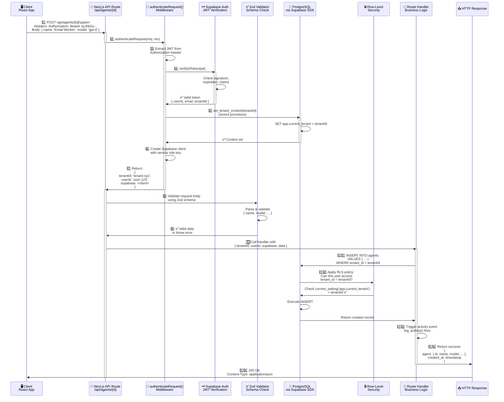
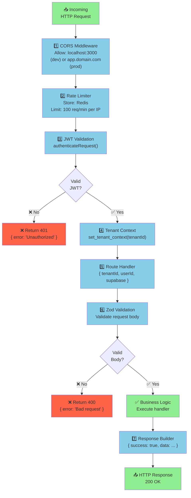

# API Architecture

## Overview

ARM exposes a **REST API** via Next.js API routes (in `src/pages/api/`). All protected routes use the `authenticateRequest()` middleware that validates JWT tokens, extracts tenant context, and provides a pre-configured Supabase client.

Think of it like a bouncer at a nightclub: Every guest (client) must show ID (JWT token). The bouncer verifies it, checks which VIP table (tenant) they're assigned to, and escorts them inside (provides context to handler). Inside, the handler ensures guests only access their own VIP area (tenant_id filtering).

---

## API Request Lifecycle (Sequence Diagram)

Here's how a single API request flows through the system:



---

## API Endpoint Structure

ARM's API is organized into logical groupings. Here are the core endpoint families:

```mermaid
graph LR
    Root["🌐 Base URL: /api"]

    Root --> Auth["🔐 /auth"]
    Auth -->|POST| Auth1["initialize<br/>(email → OTP)"]
    Auth -->|POST| Auth2["callback<br/>(otp_code → JWT)"]
    Auth -->|POST| Auth3["logout<br/>(invalidate session)"]

    Root --> Agents["👥 /agents"]
    Agents -->|GET| Ag1["list (all agents in tenant)"]
    Agents -->|POST| Ag2["create (spawn root agent)"]
    Agents -->|GET| Ag3["[id] (get specific agent)"]
    Agents -->|PATCH| Ag4["[id] (update config)"]
    Agents -->|POST| Ag5["[id]/spawn (create child)"]
    Agents -->|GET| Ag6["[id]/children (direct reports)"]
    Agents -->|GET| Ag7["[id]/descendants (full subtree)"]
    Agents -->|GET| Ag8["[id]/config (fetch config blob)"]
    Agents -->|POST| Ag9["templates (save config as template)"]

    Root --> Tasks["📋 /tasks"]
    Tasks -->|GET| T1["list (with filters)"]
    Tasks -->|POST| T2["create"]
    Tasks -->|GET| T3["[id] (get details)"]
    Tasks -->|PATCH| T4["[id] (update)"]
    Tasks -->|POST| T5["[id]/assign (assign to agent)"]
    Tasks -->|POST| T6["[id]/status (update status)"]
    Tasks -->|GET| T7["[id]/dependencies (task chain)"]

    Root --> Decisions["✅ /decisions"]
    Decisions -->|GET| D1["list"]
    Decisions -->|POST| D2["create (propose)"]
    Decisions -->|PATCH| D3["[id] (approve/reject)"]
    Decisions -->|POST| D4["[id]/override (human override)"]

    Root --> Escalations["🚨 /escalations"]
    Escalations -->|GET| E1["list (inbox)"]
    Escalations -->|GET| E2["[id] (details)"]
    Escalations -->|PATCH| E3["[id]/resolve (provide resolution)"]

    Root --> Activities["📊 /activities"]
    Activities -->|GET| A1["list (cursor pagination)<br/>?tenant_id=&limit=&cursor="]
    Activities -->|GET| A2["[id] (activity details)"]

    Root --> Messages["💬 /messages"]
    Messages -->|POST| M1["send"]
    Messages -->|GET| M2["list (conversations)"]
    Messages -->|GET| M3["[thread_id] (message thread)"]

    Root --> Analytics["📈 /analytics"]
    Analytics -->|GET| An1["dashboard (summary metrics)"]
    Analytics -->|GET| An2["daily (daily breakdown)"]
    Analytics -->|GET| An3["agents (per-agent stats)"]

    Root --> Notifications["🔔 /notifications"]
    Notifications -->|GET| N1["list"]
    Notifications -->|PATCH| N2["[id] (mark read)"]
    Notifications -->|PATCH| N3["preferences (set channels)"]

    Root --> Meta["🤖 /meta-agent"]
    Meta -->|POST| Mt1["valis (meta-agent commands)"]

    Root --> Billing["💳 /billing"]
    Billing -->|POST| B1["checkout (Stripe session)"]
    Billing -->|GET| B2["portal (customer portal)"]
    Billing -->|POST| B3["webhooks/stripe (webhook)"]

    Root --> Webhooks["🔗 /webhooks"]
    Webhooks -->|POST| W1["slack (Slack events)"]
    Webhooks -->|POST| W2["github (GitHub events)"]
    Webhooks -->|POST| W3["zapier (Zapier actions)"]

    style Root fill:#ffd700
    style Auth fill:#87ceeb
    style Agents fill:#87ceeb
    style Tasks fill:#87ceeb
    style Decisions fill:#87ceeb
    style Escalations fill:#87ceeb
    style Activities fill:#87ceeb
    style Messages fill:#87ceeb
    style Analytics fill:#87ceeb
    style Notifications fill:#87ceeb
    style Meta fill:#87ceeb
    style Billing fill:#87ceeb
    style Webhooks fill:#87ceeb
```



---

## Middleware Chain

Every request flows through this middleware stack:



---

## Route Handler Pattern

All protected route handlers follow this standard pattern:

```typescript
// src/pages/api/agents/index.ts
import { authenticateRequest } from '@/lib/api/auth';
import { createAgentSchema } from '@/lib/validation';
import type { NextApiRequest, NextApiResponse } from 'next';

export default async function handler(
  req: NextApiRequest,
  res: NextApiResponse
) {
  // 1. Authenticate & extract context
  const authResult = await authenticateRequest(req, res);
  if (!authResult) return; // Middleware already sent error response

  const { tenantId, userId, supabase } = authResult;

  // 2. Validate request method
  if (req.method === 'GET') {
    // 3. Validate query params (if applicable)
    const { limit = 20, offset = 0 } = req.query;

    // 4. Query database (tenant_id already set in context)
    const { data, error } = await supabase
      .from('agents')
      .select('*')
      .eq('tenant_id', tenantId)
      .range(offset, offset + limit - 1);

    if (error) {
      return res.status(500).json({ error: error.message });
    }

    return res.status(200).json({ agents: data });
  }

  if (req.method === 'POST') {
    // 5. Validate request body with Zod
    const validationResult = createAgentSchema.safeParse(req.body);
    if (!validationResult.success) {
      return res.status(400).json({
        error: 'Validation failed',
        issues: validationResult.error.issues
      });
    }

    const { name, model, config } = validationResult.data;

    // 6. Create new agent
    const { data: agent, error } = await supabase
      .from('agents')
      .insert({
        tenant_id: tenantId,
        parent_id: null, // Root agent
        name,
        model,
        status: 'initializing',
        config
      })
      .select();

    if (error) {
      return res.status(500).json({ error: error.message });
    }

    // 7. Return success
    return res.status(201).json({
      agent: agent[0],
      message: 'Agent created successfully'
    });
  }

  // 8. Method not allowed
  return res.status(405).json({ error: 'Method not allowed' });
}
```

---

## Key Files & Utilities

### Authentication Middleware

**File:** `src/lib/api/auth.ts`

Exports `authenticateRequest()` function:

```typescript
export async function authenticateRequest(
  req: NextApiRequest,
  res: NextApiResponse
): Promise<AuthContext | null> {
  // Returns: { tenantId, userId, supabase }
  // Throws: 401 Unauthorized
  // Throws: 400 Bad Request (missing token)
}
```

### Zod Validation Schemas

**File:** `src/lib/validation.ts`

Pre-defined schemas for all endpoints:

```typescript
export const createAgentSchema = z.object({
  name: z.string().min(1).max(100),
  model: z.enum(['gpt-4', 'gpt-4-turbo', 'claude-3-opus']),
  config: z.record(z.unknown()).optional(),
  role: z.enum(['ceo', 'manager', 'worker', 'specialist', 'system']).optional(),
});

export const createTaskSchema = z.object({
  title: z.string().min(1).max(200),
  description: z.string().optional(),
  assigned_to: z.string().uuid(),
  priority: z.enum(['low', 'normal', 'high', 'urgent']),
  due_date: z.string().datetime().optional(),
});

// ... more schemas
```

---

## Example: POST /api/agents/[id]/spawn

Here's a complete real-world example showing all layers:

**Request:**
```http
POST /api/agents/123/spawn HTTP/1.1
Host: localhost:3000
Authorization: Bearer eyJhbGc...
Content-Type: application/json

{
  "name": "Email Marketing Worker",
  "model": "gpt-4",
  "role": "worker",
  "config": {
    "email_templates_dir": "templates/marketing",
    "max_emails_per_hour": 100,
    "track_opens": true
  }
}
```

**Handler Logic:**
```typescript
// 1. Authenticate
const { tenantId, userId, supabase } = await authenticateRequest(req, res);

// 2. Validate body
const validationResult = spawnAgentSchema.safeParse(req.body);
if (!validationResult.success) {
  return res.status(400).json({ error: 'Invalid request' });
}

// 3. Get parent agent
const { data: parent } = await supabase
  .from('agents')
  .select('id, depth, role')
  .eq('id', req.query.id)
  .eq('tenant_id', tenantId)
  .single();

// 4. Validate spawning permission
if (!parent || !canSpawn(parent.role)) {
  return res.status(403).json({ error: 'Cannot spawn from this agent' });
}

// 5. Create child agent
const newAgent = {
  tenant_id: tenantId,
  parent_id: parent.id,
  depth: parent.depth + 1,
  name: validationResult.data.name,
  model: validationResult.data.model,
  role: validationResult.data.role,
  status: 'initializing',
  config: validationResult.data.config,
  created_by: userId
};

const { data: agent, error } = await supabase
  .from('agents')
  .insert(newAgent)
  .select();

// 6. Return response
return res.status(201).json({
  success: true,
  agent: agent[0],
  parent_id: parent.id
});
```

**Response:**
```json
{
  "success": true,
  "agent": {
    "id": "456",
    "tenant_id": "xyz",
    "parent_id": "123",
    "name": "Email Marketing Worker",
    "model": "gpt-4",
    "role": "worker",
    "status": "initializing",
    "depth": 2,
    "created_at": "2026-02-15T14:23:00Z"
  },
  "parent_id": "123"
}
```

---

## Error Handling

All API routes return standardized error responses:

```
┌─ HTTP Status Code
├─ 200 OK              Successful request
├─ 201 Created         Resource created
├─ 400 Bad Request     Validation failed (Zod error)
├─ 401 Unauthorized    Missing or invalid JWT
├─ 403 Forbidden       Tenant isolation violation
├─ 404 Not Found       Resource doesn't exist
├─ 409 Conflict        Business logic constraint violated
├─ 429 Too Many Requests  Rate limit exceeded
├─ 500 Internal Error  Unexpected server error
└─ 503 Service Unavailable  Database or Supabase down
```

Error response format:

```json
{
  "success": false,
  "error": "Human-readable error message",
  "code": "VALIDATION_ERROR" | "NOT_FOUND" | "UNAUTHORIZED" | ...,
  "details": { ... }  // Optional: validation details or context
}
```

---

## Performance Considerations

| Pattern | Performance | When to Use |
|---------|-------------|------------|
| **Single record query** | ⚡ < 10ms | Get specific agent |
| **List with limit** | ⚡ < 50ms | Agent roster (limit 20) |
| **List with joins** | ⚠️ 50-200ms | List tasks with agent names |
| **Full-table scan** | 🐌 1-5s | Analytics queries (usually scheduled) |
| **Cursor pagination** | ⚡ < 100ms | Activity feed (cursor-based) |

**Optimization tips:**
- ✅ Always add `.limit()` to prevent large result sets
- ✅ Use RLS filters to reduce rows checked by PostgreSQL
- ✅ Use indexes (they're defined in migrations)
- ✅ Avoid N+1 queries (use `.select('table!inner (*)')` for joins)
- ❌ Don't fetch all agents without a limit
- ❌ Don't query without tenant_id filter

---

## Rate Limiting

Rate limiting is enforced at the middleware level:

```
Per-IP limits:
├─ Public endpoints (auth):   60 requests/min
├─ Protected endpoints:        100 requests/min
├─ Analytics endpoints:        30 requests/min
└─ Webhooks:                   1000 requests/min

Storage:
└─ Redis (with 1-hour TTL)
```

Rate limit headers in response:

```
X-RateLimit-Limit: 100
X-RateLimit-Remaining: 87
X-RateLimit-Reset: 1644936180
```

---

## Best Practices

### For API Consumers
- ✅ Implement exponential backoff for retries
- ✅ Use cursor pagination (don't poll without sleep)
- ✅ Cache responses locally when appropriate
- ✅ Monitor rate limit headers
- ❌ Don't make synchronous API calls in UI render loops
- ❌ Don't retry immediately on 500 errors

### For API Developers
- ✅ Always validate input with Zod
- ✅ Always filter by tenant_id
- ✅ Always include error codes in responses
- ✅ Use RLS policies as defense-in-depth
- ✅ Log all errors for debugging
- ❌ Don't bypass authenticateRequest()
- ❌ Don't expose error details to clients

---

## Related Documentation

- [[02-auth-flow]] — How JWT authentication works
- [[03-multi-tenancy]] — How tenant isolation works via RLS
- [[10-event-system]] — How API changes trigger activities
- [[06-data-model]] — Database schema all endpoints access
- [[ARCHITECTURE]] — Overall system design

---

## See Also

- `src/pages/api/` — All API route implementations
- `src/lib/api/auth.ts` — authenticateRequest() middleware
- `src/lib/validation.ts` — Zod schemas for validation
- `src/lib/supabase.ts` — Supabase client initialization
- `docs/API.md` — Detailed endpoint documentation
