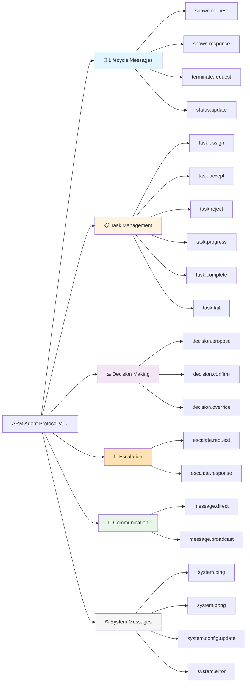
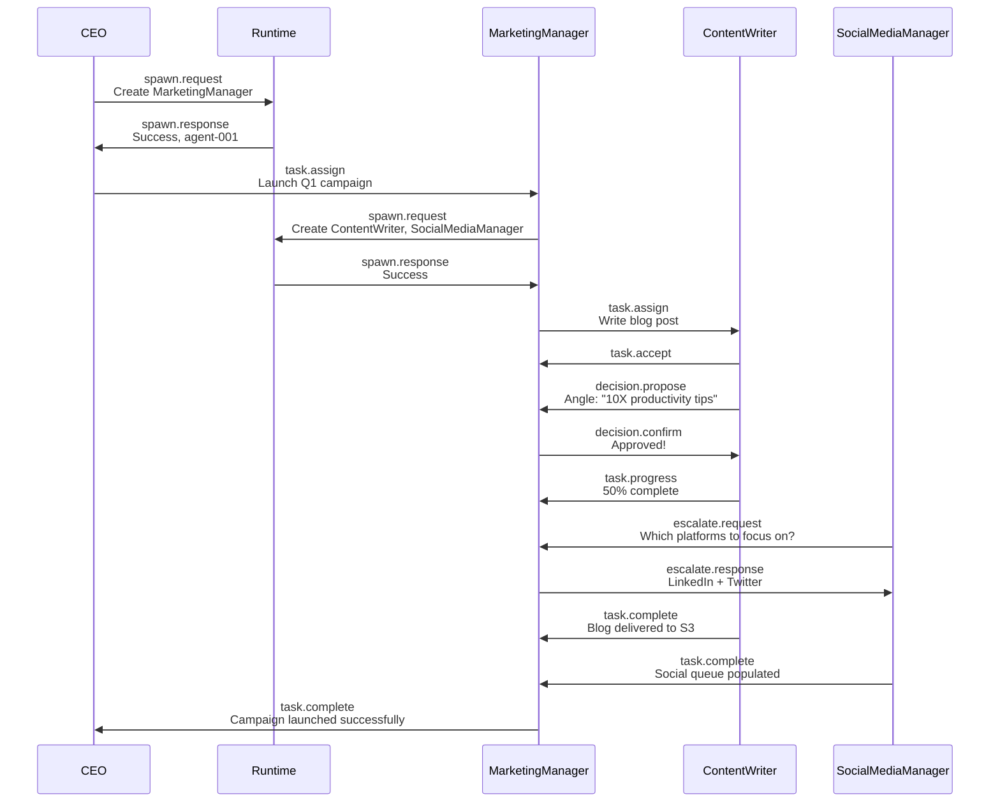
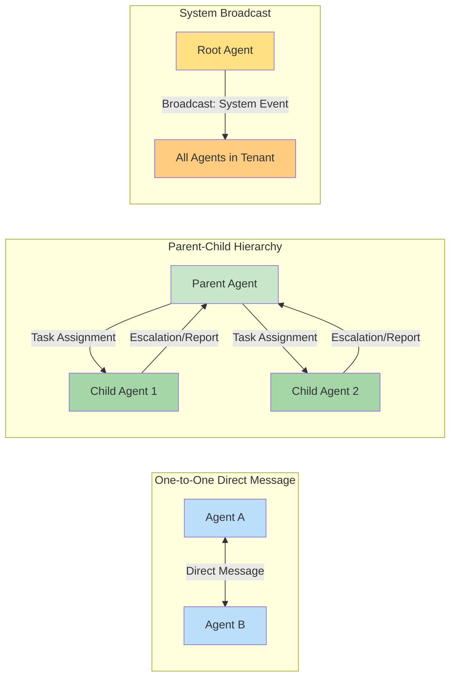

# ARM Agent Protocol (AAP) Specification

The **ARM Agent Protocol (AAP) v1.0** defines how agents communicate within the Pink Beam system. All communication between agents is via structured messages with a standardized format that ensures reliable routing, priority handling, and auditability.

## Message Structure

Every message contains:

- **Headers**: Unique message ID, protocol version, and timestamp
- **Routing**: Sender (from), recipient (to), thread ID for conversation tracking
- **Content**: Message type (spawn.request, task.assign, etc.) and payload data
- **Metadata**: Priority level, time-to-live (TTL), acknowledgment requirement, correlation ID for tracing

This structure enables the system to route millions of messages across agent hierarchies, track conversations, and maintain audit trails.

## Message Types Classification

## Complete Agent Conversation Example

This sequence diagram illustrates a real multi-level agent workflow: a CEO spawning a manager, the manager spawning specialists, assigning tasks, making decisions, handling escalations, and reporting completion.

## Communication Patterns

## Message Priority & Error Handling

### Priority Levels

Messages are processed according to priority:

1. **urgent** — Critical system events, security alerts, terminal errors
2. **high** — Time-sensitive decisions, escalations, task completions
3. **normal** — Regular task updates, routine decisions, status changes
4. **low** — Analytics, telemetry, logging, non-urgent messages

### Error Types

The system recognizes and handles these standard errors:

- `INVALID_MESSAGE_FORMAT` — Malformed message structure or missing required fields
- `UNKNOWN_RECIPIENT` — Agent ID not found in tenant
- `PERMISSION_DENIED` — Sender lacks authority to perform action (role-based)
- `TIMEOUT` — No response within TTL window
- `RATE_LIMITED` — Message queue full or rate limit exceeded
- `AGENT_UNAVAILABLE` — Agent is paused, blocked, or terminated
- `DUPLICATE_MESSAGE` — Message with same ID already processed (idempotency)

## Related Concepts

- **[[04-agent-hierarchy]]** — How agents form teams and trees
- **[[08-decision-flow]]** — Decision-making authority and approval workflows
- **[[09-escalation-workflow]]** — How escalations bubble up the hierarchy
- **[[AGENT-PROTOCOL]]** — Full AAP specification document

---

*Last updated: 2026-02-15*
