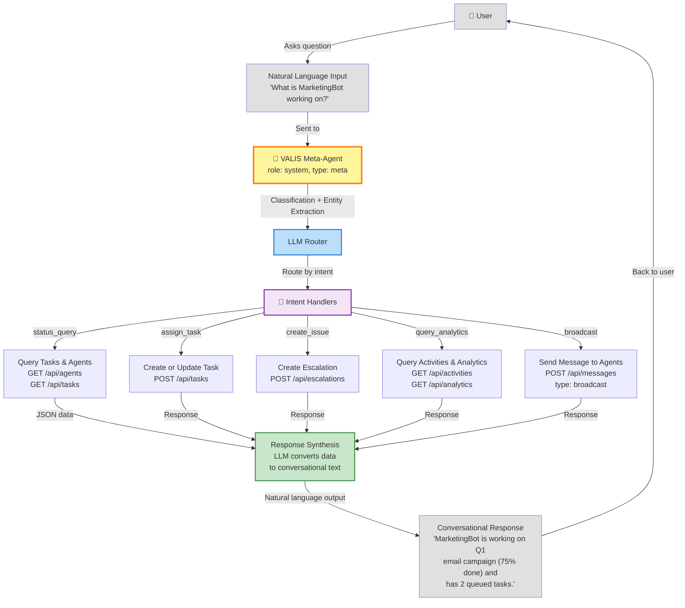
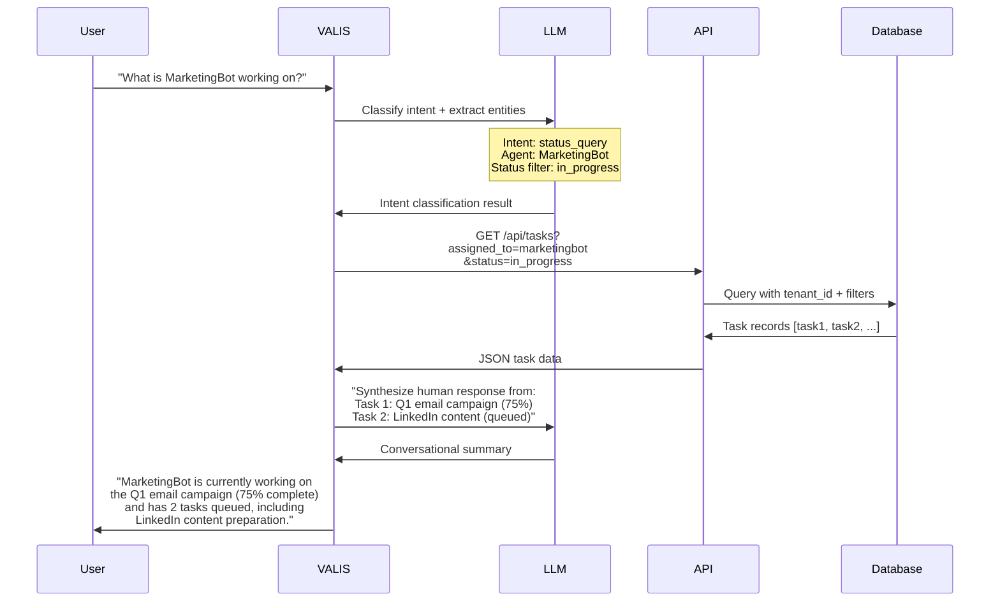
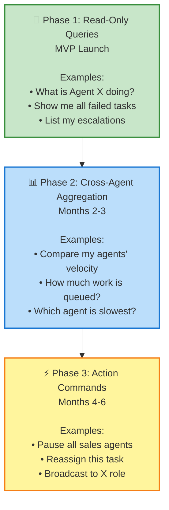

# VALIS Meta-Agent Architecture

**VALIS** (codename) is the planned **meta-agent** for Pink Beam ARM — a system-level natural language interface that provides conversational access to the entire agent workforce.

## What is VALIS?

VALIS is **NOT** a CEO agent. It is a special **system-level agent** (role: `system`, type: `meta`) that:

- Accepts **natural language queries** from humans
- Routes queries to appropriate data endpoints or agent commands
- Synthesizes responses back into conversational natural language
- Operates **within tenant boundaries** (never crosses tenant data)
- Serves as a **bridge between human language and agent commands**

VALIS is intentionally deferred to **post-MVP**, but the architectural foundation is built into ARM from day one. This ensures a smooth, no-refactor transition when the time comes to activate it.

---

## VALIS Architecture



---

## Phase 1: Natural Language Queries (Read-Only)

This is the **first phase** and the post-MVP target. It enables pure read-only queries across the entire workforce without exposing any agent internals.



---

## Three-Phase Roadmap



---

## MVP Architectural Foundations (Already Built)

ARM's foundation is **intentionally designed for VALIS**. These components are already in place and require no refactoring:

### 1. System Agent Type
A reserved agent per tenant with:
- `role: 'system'`
- `type: 'meta'`
- Bypasses standard RLS within tenant scope
- Cannot be deleted or manually manipulated

### 2. Queryable Activity Schema
The `activities` table stores every state change:
```
{
  id, tenant_id, agent_id,
  event_type: 'task.created' | 'task.completed' | 'escalation.filed' | ...,
  entity_type: 'task' | 'agent' | 'decision' | 'escalation',
  entity_id,
  data: JSONB { ... },
  created_at, updated_at
}
```
This rich event log is the **source of truth for VALIS queries**.

### 3. Flexible API Filtering
All query endpoints support:
- `agent_id`, `agent_type`, `agent_role` — filter by agent properties
- `status` — queued, in_progress, completed, failed, blocked, etc.
- `time_range` — relative (last_day, last_week) or absolute (start_date, end_date)
- `event_type` — task.created, escalation.filed, etc.
- `entity_type` — task, agent, decision, escalation
- `priority` — urgent, high, normal, low

### 4. Permission Model
System agents operate within tenant boundaries:
- All queries scoped to `current_tenant` via RLS
- No cross-tenant data leakage
- System agents cannot spawn child agents
- System agents cannot execute tasks

### 5. Message Protocol
Agent-to-agent messaging already supports:
- **Direct messages** — VALIS → Agent (future: action commands)
- **Broadcast messages** — VALIS → All agents of role X (future: pause all sales agents)
- **Routing** — Hierarchical routing for complex workflows
- **Acknowledgment** — Optional message acknowledgment tracking

---

## TypeScript Foundation

These types are already defined in `src/lib/types/agent.ts` (awaiting activation):

```typescript
// VALIS intent classification
type MetaAgentIntent =
  | 'status_query'           // What is Agent X doing?
  | 'assign_task'            // (Phase 2+) Assign task to Agent X
  | 'create_issue'           // (Phase 2+) File escalation
  | 'query_analytics'        // Compare agents, performance queries
  | 'broadcast'              // (Phase 3+) Send message to all agents
  | 'pause_agent'            // (Phase 3+) Pause an agent
  | 'abort_task';            // (Phase 3+) Stop a task

// VALIS session tracking
type MetaAgentSession = {
  id: string;
  tenant_id: string;
  meta_agent_id: string;
  user_id: string;
  conversation_history: Message[];
  created_at: Date;
  expires_at: Date;
};

// VALIS command from LLM
type MetaAgentCommand = {
  intent: MetaAgentIntent;
  entities: Record<string, string | number>;
  confidence: number;
  reasoning: string;
};

// VALIS result
type MetaAgentResult = {
  success: boolean;
  data: Record<string, any>;
  summary: string;
  confidence: number;
  time_ms: number;
};

// Handler interface (extensible)
type IntentHandler = (
  command: MetaAgentCommand,
  context: { tenantId: string; supabase: SupabaseClient }
) => Promise<MetaAgentResult>;
```

---

## Why VALIS is Deferred to Post-MVP

1. **MVP focus**: Prove core agent spawning, task management, and escalations work flawlessly
2. **LLM integration**: Avoids adding LLM dependency until foundation is solid
3. **No refactoring**: All infrastructure exists; activation is additive only
4. **User feedback**: Gather real agent workflows before designing NL interface
5. **Security**: More time to harden RLS and permission models

---

## Related Concepts

- **[[04-agent-hierarchy]]** — How agents form organizational structures
- **[[12-agent-protocol]]** — Message types and routing VALIS will leverage
- **[[11-api-architecture]]** — Query endpoints VALIS will call
- **[[ARCHITECTURE]]** — System-wide design principles

---

*Last updated: 2026-02-15*
*Status: Foundation complete. Activation scheduled for Phase 2.*
