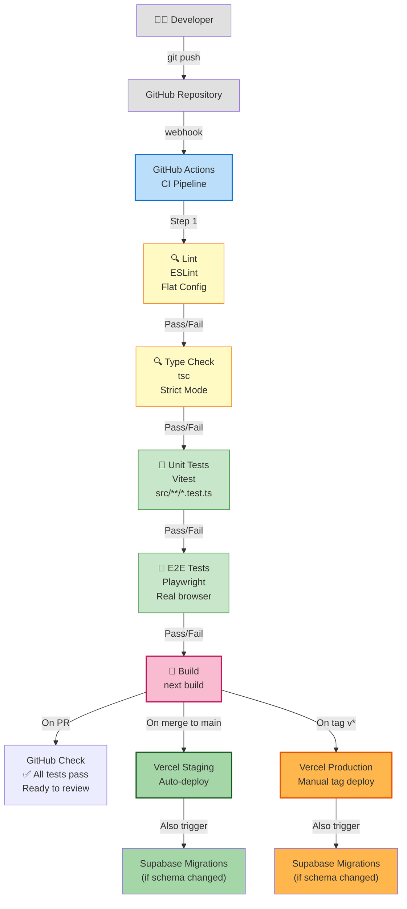
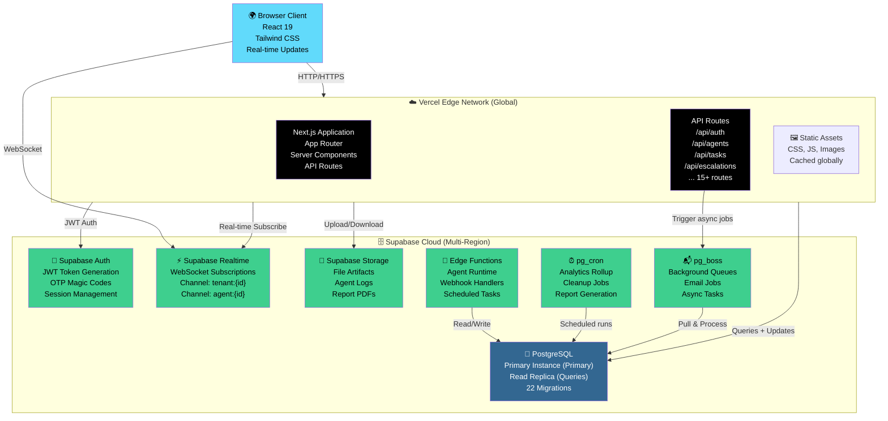
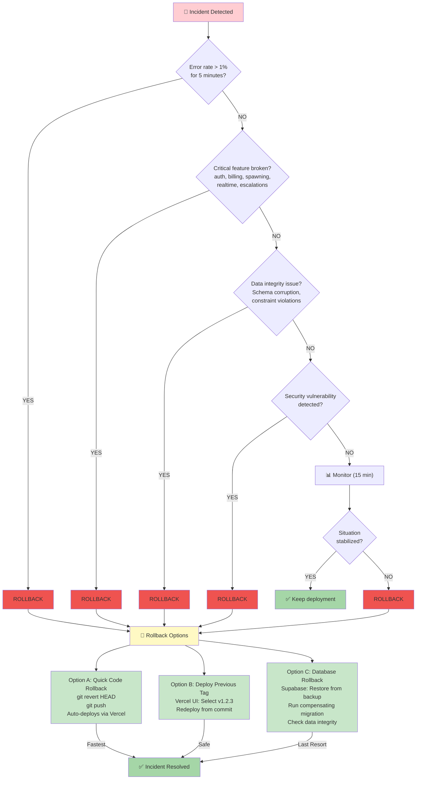

# ARM Deployment Architecture

Pink Beam ARM is deployed across **Vercel** (application hosting) and **Supabase** (database, auth, realtime, file storage, background jobs). All changes flow through a **GitHub Actions CI/CD pipeline** that tests, builds, and deploys automatically.

---

## CI/CD Pipeline

Every push to GitHub triggers automated tests and builds. Merges to `main` deploy to staging; tags deploy to production.



### CI Pipeline Steps

1. **Lint** — ESLint checks for code style violations (flat config, Next.js + TypeScript rules)
2. **Type Check** — TypeScript compiler validates all types in strict mode
3. **Unit Tests** — Vitest runs all `*.test.ts` and `*.test.tsx` files
4. **E2E Tests** — Playwright runs browser automation tests against a staging instance
5. **Build** — Next.js builds the production bundle; fails if any of the above steps fail

### Deployment Triggers

| Branch | Condition | Destination | Note |
|--------|-----------|-------------|------|
| `main` | Merge to main | Vercel Staging | Auto-deploy on every merge |
| Tags | `git tag v*.*.* && git push --tags` | Vercel Production | Manual tag-based deployment |
| Any | PR opened | GitHub Check | Shows pass/fail in PR UI |

---

## Infrastructure

ARM's infrastructure spans two platforms: Vercel for the application layer and Supabase for the data/auth/realtime layer.



### Key Infrastructure Components

**Vercel (Edge Network)**
- Serves Next.js application globally
- Auto-scales based on traffic
- CDN for static assets
- Environment variables per deployment

**Supabase (Multi-Region)**
- PostgreSQL with automatic backups
- Read replica for scaling queries
- Real-time WebSocket pub/sub
- Built-in S3-compatible file storage
- Serverless Edge Functions (Deno runtime)
- Scheduled jobs via pg_cron
- Async job queue via pg_boss

---

## Rollback Decision Tree

If something goes wrong in production, this decision tree guides the response.



---

## Environments

ARM operates across three environments, each with distinct purposes and deployment triggers.

### Local (Development)

```
npm run dev
Runs on: http://localhost:3000
Database: Local Supabase instance (Docker)
Auth: Local OTP flow
Realtime: Local WebSocket
Used for: Feature development, debugging
```

### Staging

```
URL: arm-staging.vercel.app
Database: Supabase staging project
Deployment: Auto-deploys on merge to main
Lifespan: Every commit
Purpose: Pre-production testing, E2E tests run here
Cleanup: 7-day retention for data
```

### Production

```
URL: arm.pink-beam.com (custom domain)
Database: Supabase production project
Deployment: Manual tag-based deployment (v*.*.*)
Lifespan: Stays until replaced by new tag
Purpose: Live users, real data, SLA'd uptime
Backups: Hourly backups, 30-day retention
```

---

## Environment Variables

All three environments share these variable names but different values:

### Client-Side (Public)

These are visible in the browser and included in the bundle:

```
NEXT_PUBLIC_SUPABASE_URL
  → Project URL from Supabase dashboard
  → e.g., https://abcdefg.supabase.co

NEXT_PUBLIC_SUPABASE_ANON_KEY
  → Publishable key (row-level security enforced)
  → e.g., eyJ... (starts with 'sb_')

NEXT_PUBLIC_APP_URL
  → Application URL for auth redirects
  → dev: http://localhost:3000
  → staging: https://arm-staging.vercel.app
  → prod: https://arm.pink-beam.com
```

### Server-Side (Secret)

These are never exposed to the browser:

```
SUPABASE_SERVICE_ROLE_KEY
  → Bypasses RLS (use in API routes only)
  → e.g., eyJ... (starts with 'sbprivate_')
  → Stored in Vercel environment settings (encrypted)
  → Never committed to git

RESEND_API_KEY
  → Transactional email API key
  → e.g., re_abc123...
  → Used only in server-side email functions
  → Stored in Vercel environment settings (encrypted)
```

---

## Monitoring & Observability

### Key Metrics

- **Error rate** — % of requests that fail (threshold: 1%)
- **Response time** — P95 latency (target: < 500ms)
- **Agent spawning latency** — Time from spawn.request to spawn.response (target: < 2s)
- **Realtime latency** — Time from event fire to subscription update (target: < 100ms)
- **Database query P95** — Query latency (target: < 100ms)

### Logs

Logs are accessible via Supabase dashboard:

- **API Logs** — All HTTP requests to `/api/*`
- **Postgres Logs** — Database queries, slow queries, errors
- **Edge Function Logs** — Async job execution, webhooks
- **Auth Logs** — Login attempts, token generation, errors

---

## Deployment Checklist

Before deploying to production, verify:

- [ ] All CI checks pass (lint, type, tests, build)
- [ ] Code reviewed and approved (GitHub)
- [ ] Database migrations tested on staging
- [ ] E2E tests pass against staging
- [ ] No breaking API changes to agent protocol
- [ ] Rollback plan documented in incident response
- [ ] Team notified via Slack/email
- [ ] Tag created: `git tag v*.*.* && git push --tags`

---

## Related Concepts

- **[[11-api-architecture]]** — API route structure and patterns
- **[[01-system-overview]]** — System components and data flow
- **[[CICD]]** — Detailed CI/CD configuration
- **[[INCIDENT-RESPONSE]]** — Procedures for handling production incidents

---

*Last updated: 2026-02-15*
*Deployment: Vercel + Supabase | CI: GitHub Actions*
